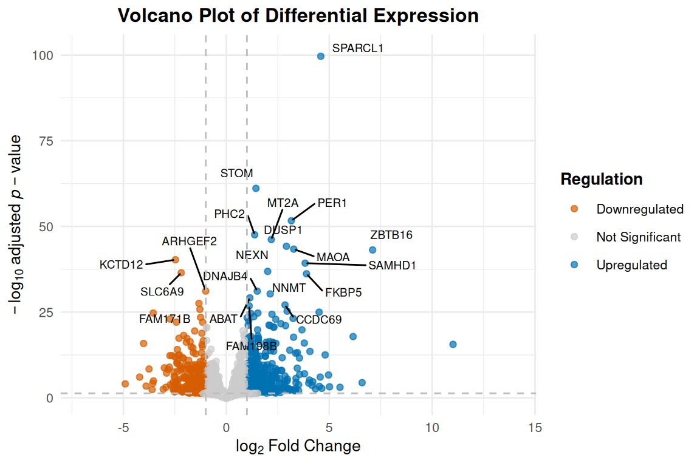
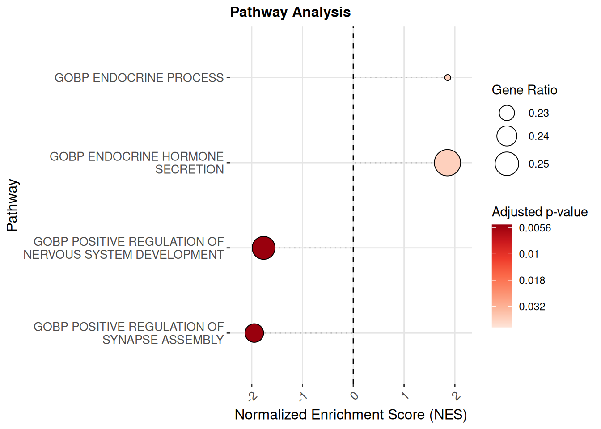
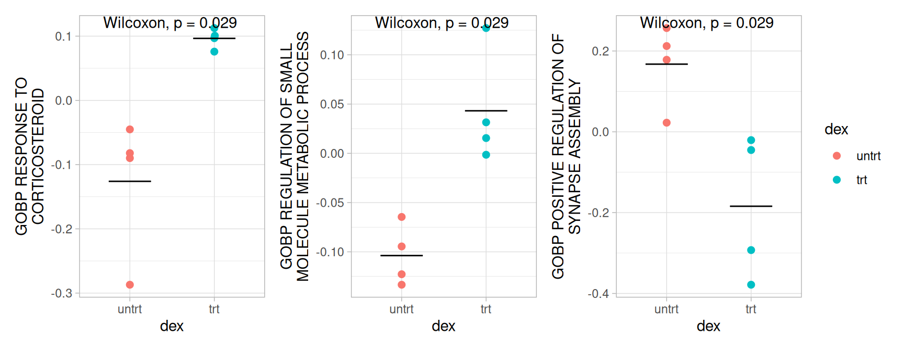
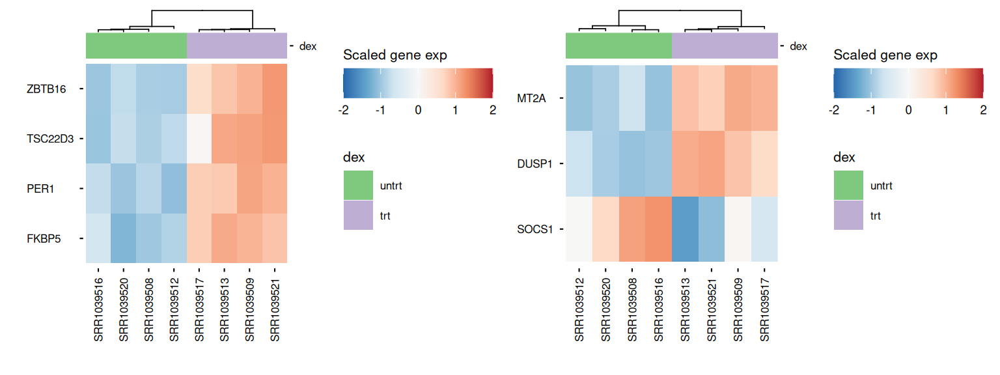
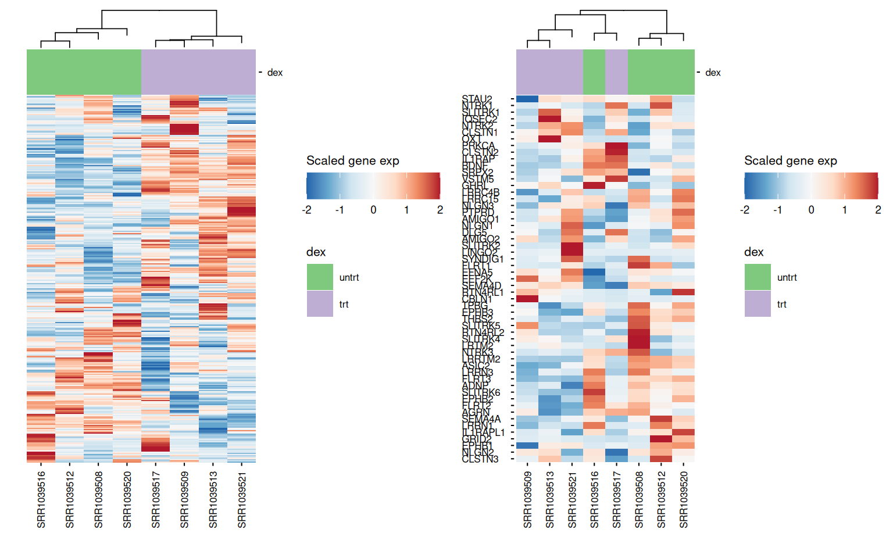

# Supervised RNA-seq analysis


For the supervised and unsupervised analyses, we are using an open
dataset which is given by the `airway` package. It provides a gene
expression dataset derived from **human bronchial epithelial cells**,
treated or not with **dexamethasone** (a corticosteroid).

Dexamethasone treatment is expected to triggers a stress‐response
program and reset the peripheral circadian clock.

The treatment information is recorded in the `dex` column of the data.

Here is an example of how the **supervised** part of the `CAIBIrnaseq`
package.

First, we need to import the required packages :

Code

``` r
library(airway)
library(SummarizedExperiment)
library(CAIBIrnaseq)
library(tidyverse)
library(patchwork)
```

As you go through the notebook, you’ll define a few variables along the
way (gene/pathway names, grouping variables, etc.) right before the step
that uses them, so you can adapt each one to your own dataset without
hunting through the surrounding code.

## Load data

This section loads the RNA-seq dataset for analysis. It ensures the
correct input file is used, as specified in the parameters. rebase_gexp

Ensure your dataset is in a `Summarized Experiment` object, because all
the used functions below works with this type of input.

If you want to know more about this type of object, please click here:
[Bioconductor](https://bioconductor.org/packages/release/bioc/vignettes/SummarizedExperiment/inst/doc/SummarizedExperiment.html)

If you have a .xsl file (Excel), there is an existing notebook to
convert it in a .RDS file.

Code

``` r
data(airway, package="airway")
exp_data <- airway
rowData(exp_data)$gene_length_kb <- 
  (rowData(exp_data)$gene_seq_end - rowData(exp_data)$gene_seq_start) / 1000

# If you are using your own dataset .RDS file), use this command line : 
# exp_data <- readRDS(data_file)
exp_data
```

    class: RangedSummarizedExperiment
    dim: 63677 8
    metadata(1): ''
    assays(1): counts
    rownames(63677): ENSG00000000003 ENSG00000000005 ... ENSG00000273492
      ENSG00000273493
    rowData names(11): gene_id gene_name ... symbol gene_length_kb
    colnames(8): SRR1039508 SRR1039509 ... SRR1039520 SRR1039521
    colData names(9): SampleName cell ... Sample BioSample

Code

``` r
colnames(SummarizedExperiment::rowData(exp_data))
```

     [1] "gene_id"          "gene_name"        "entrezid"         "gene_biotype"
     [5] "gene_seq_start"   "gene_seq_end"     "seq_name"         "seq_strand"
     [9] "seq_coord_system" "symbol"           "gene_length_kb"  

Even if the datasets are globally build the same way, the names of the
variables are not exactly the same, so if we want to keep the same code,
we need to redefine a bit the variables.

If data was generated by CAIBI from an nf-core/RNAseq pipeline, the
`salmon.merged.gene_counts_scaled.rds` RDS object included with the
outputs will already be in the appropriate format.

If not, you should look at how your dataset is constructed. You might
need to gene annotation metadata. We suggest using
\[[`biomaRt::getBM`](https://rdrr.io/pkg/biomaRt/man/getBM.html)\].

## Pre-processing

Most datasets use ensembl gene ID by default after alignment, so this
step rebases the expression data to gene names. This ensures consistency
in naming for downstream analyses. This may be skipped if the exp_data
already uses `gene_name` or `gene_symbol` as its default ID.

Code

``` r
exp_data <- rebase_gexp(exp_data, keep_cols = c("gene_name", "gene_id", 
                                                "gene_biotype", "gene_length_kb"))
exp_data
```

    class: SummarizedExperiment
    dim: 56638 8
    metadata(0):
    assays(2): counts tpm
    rownames(56638): 5S_rRNA 7SK ... snosnR66 yR211F11.2
    rowData names(4): gene_name gene_id gene_biotype gene_length_kb
    colnames(8): SRR1039508 SRR1039509 ... SRR1039520 SRR1039521
    colData names(9): SampleName cell ... Sample BioSample

### Filter

Here, we filter out genes expressed in too few samples or with very low
counts. This removes noise from the data and focuses on meaningful gene
expressions. In this example, only zero-expression genes will be
filtered, which is appropriate for a lot of analyses.

Code

``` r
exp_data <- filter_gexp(exp_data,
                        min_nsamp = 1, 
                        min_counts = 1)
```

Visualization of the filtering process to ensure the criteria applied
align with the dataset’s characteristics:

Code

``` r
colData(exp_data)$sample_id <- colnames(exp_data)
plot_qc_filters(exp_data)
```

### Normalize

Here, we apply a **normalization** to the expression data, making
samples comparable by reducing variability due to technical differences.
For datasets with few samples, `rlog` is the preferred normalization and
when more samples are present, `vst` is applied.

Code

``` r
exp_data <- normalize_gexp(exp_data)
```

## PCA

**Principal component analysis** (PCA) identifies the major patterns in
the dataset. These patterns help explore similarities or differences
among samples based on gene expression.

We also define the grouping variable of interest here — the column in
`colData` representing our main condition of interest. We’ll reuse it
throughout the analysis: to color the PCA, as the design variable for
differential expression, and as an annotation track for heatmaps and
boxplots.

Code

``` r
group_var <- "dex"

metadata(exp_data)[["pca_res"]] <- pca_gexp(exp_data)
plot_pca(exp_data, color = group_var, ellipses = TRUE)
```

    Warning: The following aesthetics were dropped during statistical transformation: label.
    ℹ This can happen when ggplot fails to infer the correct grouping structure in
      the data.
    ℹ Did you forget to specify a `group` aesthetic or to convert a numerical
      variable into a factor?
    The following aesthetics were dropped during statistical transformation: label.
    ℹ This can happen when ggplot fails to infer the correct grouping structure in
      the data.
    ℹ Did you forget to specify a `group` aesthetic or to convert a numerical
      variable into a factor?

## Differential expression

**Differential expression analysis** is a statistical method used to
identify genes whose expression levels significantly change between
different experimental conditions, *i.e* differentially expressed genes
(DEGs). These changes in gene expression can provide insights into the
biological processes or pathways affected, and help identify key
molecular players involved in a condition or phenotype.

### Design

The differential expression `design` argument allows us to control which
variables will be considered sources of biological (or technical)
variation by the model.

In our example, we say our only source of variation is the `group_var`
variable (which corresponds to the treatment column, `dex`).

The `~` symbol may be added before the variable name to represent that
it’s the independent variable (i.e. the differential expressed genes
will depend on `group_var` *i.e.* `DEGs ~ group_var`.

However, it is possible to make an additive model by adding variables
together in the design (e.g. `design = "~ var1 + var2"`). This can be
very useful and lead to more accurate and stringent DEGs prediction than
doing separate analyses for different variables.

The model can also consider interactions, but this is a more advanced
topic and should be explored from a statistical point of view.

### Constrasts

Contrasts are how we tell the model what to compare. For our function,
contrasts should be defined as a string with exactly three elements: the
name of a variable in the design formula, the name of the numerator
level for the fold change, and the name of the denominator level for the
fold change, separated by `_vs_`.

For example: `dex_trt_vs_untrt` : for variable dex, compare treated
(`trt`) vs untreated `untrt` samples.

- Variable: `dex`
- Numerator: `trt`
- Denominator: `untrt`

Genes with positive fold-change will be up-regulated in the numerator
(`trt`).

Available contrasts will be built from the levels of the variable, where
the first level will be used as denominator and all other levels as
possible numerators.

> Warning: Pay attention to the order of levels in the variable as this
> may lead to wrong comparisons where numerator/denominator are
> inverted. It may need to be altered manually, as in our example below.

> Note: if contrasts are not given, all possible contrasts will be
> returned (with levels in automatic order)

### Fitting the model

Code

``` r
colData(exp_data)$dex <- factor(colData(exp_data)$dex, levels = c("untrt", "trt"))
diffexp <- diffExpAnalysis(exp_data, design = group_var, contrasts = "dex_trt_vs_untrt")
```

### Volcano plot

A **volcano plot** is a graphical tool used to visualize the results of
differential expression analysis. It plots the statistical significance
on the y-axis against the magnitude of change on the x-axis for each
gene.

Code

``` r
volcano_plot <- plot_exp_volcano(diffexp, 20)
volcano_plot
```

[](https://crcordeliers.github.io/CAIBIrnaseq/articles/sup_rnaseq_files/figure-html/unnamed-chunk-6-1.png)

### Top differentially-expressed genes

The differentially expressed genes (DEGs) can be checked directly from
the results.

Here, we show the top 30 most differentially-expressed genes:

Code

``` r
diffexp |>
  slice(1:30)
```

|         |    baseMean | log2FoldChange |     lfcSE | pvalue | padj |
|:--------|------------:|---------------:|----------:|-------:|-----:|
| SPARCL1 |    997.4590 |       4.588342 | 0.2121691 |      0 |    0 |
| STOM    |  11193.9381 |       1.437605 | 0.0849568 |      0 |    0 |
| PER1    |    776.6130 |       3.158757 | 0.2023439 |      0 |    0 |
| PHC2    |   2738.0321 |       1.375870 | 0.0917735 |      0 |    0 |
| MT2A    |   3656.3436 |       2.184313 | 0.1480886 |      0 |    0 |
| DUSP1   |   3409.0890 |       2.919829 | 0.2026634 |      0 |    0 |
| MAOA    |   2341.8179 |       3.274171 | 0.2292011 |      0 |    0 |
| ZBTB16  |    385.0749 |       7.107543 | 0.5009888 |      0 |    0 |
| KCTD12  |   2649.9218 |      -2.474067 | 0.1797743 |      0 |    0 |
| SAMHD1  |  12703.6077 |       3.829537 | 0.2807915 |      0 |    0 |
| NEXN    |   5393.2150 |       2.008149 | 0.1524976 |      0 |    0 |
| SLC6A9  |    229.6453 |      -2.192193 | 0.1671431 |      0 |    0 |
| FKBP5   |   2564.4337 |       3.895135 | 0.2988390 |      0 |    0 |
| ARHGEF2 |   2250.6470 |      -1.002539 | 0.0825635 |      0 |    0 |
| DNAJB4  |   1467.6663 |       1.502061 | 0.1240173 |      0 |    0 |
| NNMT    |   7433.0763 |       2.129004 | 0.1787083 |      0 |    0 |
| ABAT    |    498.7005 |       1.143222 | 0.0973847 |      0 |    0 |
| FAM171B |   1303.3082 |      -1.331451 | 0.1167911 |      0 |    0 |
| CCDC69  |   2057.2438 |       2.852120 | 0.2527701 |      0 |    0 |
| FAM198B |   5596.4628 |       1.109075 | 0.0985036 |      0 |    0 |
| COL1A1  | 100992.9955 |      -1.285677 | 0.1162955 |      0 |    0 |
| GLUL    |  19611.5929 |       2.954573 | 0.2713427 |      0 |    0 |
| KLF15   |    561.1218 |       4.508089 | 0.4164685 |      0 |    0 |
| VCAM1   |    508.1780 |      -3.548945 | 0.3290099 |      0 |    0 |
| STEAP1  |   1920.7503 |       1.532424 | 0.1420552 |      0 |    0 |
| JADE1   |   1570.6660 |       1.188486 | 0.1103296 |      0 |    0 |
| FGD4    |   1223.4792 |       2.217150 | 0.2073593 |      0 |    0 |
| ARMC8   |   1010.3123 |       1.335065 | 0.1264607 |      0 |    0 |
| RAP2B   |    630.8901 |      -1.251762 | 0.1190572 |      0 |    0 |
| MORF4L2 |   5040.5952 |       1.012343 | 0.0964122 |      0 |    0 |

The most important values are `log2FoldChange` and `padj` (you may see
the explanation for all outputs by checking
[`? DESeq2::results`](https://rdrr.io/pkg/DESeq2/man/results.html))

- `log2FoldChange`: the effect size estimate. This value indicates how
  much the gene’s expression seems to have changed between the
  comparison and control groups. This value is reported on a logarithmic
  scale to base 2.
- `padj`: Adjusted P-value for multiple testing for the gene or
  transcript.

We should privilege using the adjusted p-value to account for
false-discoveries. Fold-changes are shrunk with `apeglm` by default to
avoid noise and preserve large differences. (see:
[`? DESeq2::lfcShrink`](https://rdrr.io/pkg/DESeq2/man/lfcShrink.html)
and the [`apeglm`
paper](https://academic.oup.com/bioinformatics/article/35/12/2084/5159452)).

## Pathway analysis

Pathway collections available in the MSIGdb can be specified below.
These pathways are scored and ranked by their variance in the data.
These are the available collections (use `gs_subcollection` as name
except for Hallmarks, which should be ‘H’).

Code

``` r
msigdbr::msigdbr_collections()
```

| db_version | gs_collection | gs_subcollection | gs_collection_name                   | num_genesets |
|:-----------|:--------------|:-----------------|:-------------------------------------|-------------:|
| 2026.1.Hs  | C1            |                  | Positional                           |          302 |
| 2026.1.Hs  | C2            | CGP              | Chemical and Genetic Perturbations   |         3555 |
| 2026.1.Hs  | C2            | CP               | Canonical Pathways                   |           19 |
| 2026.1.Hs  | C2            | CP:BIOCARTA      | BioCarta Pathways                    |          292 |
| 2026.1.Hs  | C2            | CP:KEGG_LEGACY   | KEGG Legacy Pathways                 |          186 |
| 2026.1.Hs  | C2            | CP:KEGG_MEDICUS  | KEGG Medicus Pathways                |          658 |
| 2026.1.Hs  | C2            | CP:PID           | PID Pathways                         |          196 |
| 2026.1.Hs  | C2            | CP:REACTOME      | Reactome Pathways                    |         1839 |
| 2026.1.Hs  | C2            | CP:WIKIPATHWAYS  | WikiPathways                         |          925 |
| 2026.1.Hs  | C3            | MIR:MIRDB        | miRDB                                |         2377 |
| 2026.1.Hs  | C3            | MIR:MIR_LEGACY   | MIR_Legacy                           |          221 |
| 2026.1.Hs  | C3            | TFT:GTRD         | GTRD                                 |          506 |
| 2026.1.Hs  | C3            | TFT:TFT_LEGACY   | TFT_Legacy                           |          610 |
| 2026.1.Hs  | C4            | 3CA              | Curated Cancer Cell Atlas gene sets  |          148 |
| 2026.1.Hs  | C4            | CGN              | Cancer Gene Neighborhoods            |          427 |
| 2026.1.Hs  | C4            | CM               | Cancer Modules                       |          431 |
| 2026.1.Hs  | C5            | GO:BP            | GO Biological Process                |         7538 |
| 2026.1.Hs  | C5            | GO:CC            | GO Cellular Component                |         1080 |
| 2026.1.Hs  | C5            | GO:MF            | GO Molecular Function                |         1872 |
| 2026.1.Hs  | C5            | HPO              | Human Phenotype Ontology             |         5793 |
| 2026.1.Hs  | C6            |                  | Oncogenic Signature                  |          189 |
| 2026.1.Hs  | C7            | IMMUNESIGDB      | ImmuneSigDB                          |         4872 |
| 2026.1.Hs  | C7            | VAX              | HIPC Vaccine Response                |          347 |
| 2026.1.Hs  | C8            |                  | Cell Type Signature                  |          866 |
| 2026.1.Hs  | C9            |                  | Computational Perturbation Signature |           62 |
| 2026.1.Hs  | H             |                  | Hallmark                             |           50 |

### Optional: Filtering pathways

First, we specify which collections to pull from MSIGdb and the species
(matching your dataset’s organism), then get the pathway collections
using the `get_annotation_collection` function.

Code

``` r
collections <- c("Hallmark", "GO:BP")
species <- "human"

pathways <- get_annotation_collection(collections,
                                      species = species)
```

    -- Collecting Hallmark from MSigDB...

    -- Collecting GO:BP from MSigDB...

To ease the interpretation of the pathway enrichment outputs, we can
filter the pathways to remove pathways that have a gene set that is too
small (too specific) or too large (too general).

Code

``` r
keep_pathways <- pathways |> count(pathway) |> dplyr::filter(n >= 30 & n <= 500) |> pull(pathway)
pathways <- pathways |> filter(pathway %in% keep_pathways)
```

### Pathway scores

For scoring pathways from differential expression analysis results, we
propose two scoring methods:

- **Overrepresentation Analysis (ORA)** treats your significant hits
  (e.g. DE genes above a chosen cutoff) as a “bag” and asks whether any
  known pathway is represented more often in that bag than you’d expect
  by chance—typically via a Fisher’s exact or hypergeometric test
  against all measured genes. It’s extremely fast and easy to interpret,
  but hinges on where you set your significance cutoff.

- **(Fast) Gene Set Enrichment Analysis (FGSEA)** avoids that arbitrary
  cutoff by taking a ranked list of all genes (for example, sorted based
  on p-value and fold‑change sign) and “walking” down it to see if
  members of each pathway accumulate at the top or bottom. You end up
  with an enrichment score for each pathway, and statistical
  significance comes from permuting phenotype labels. GSEA is more
  sensitive to coordinated, subtle shifts across a pathway.

Code

``` r
pathwayResult <- pathwayAnalysis(diffexp, 
                              pathways = pathways,
                              method = "ora")

pathwayResult2 <- pathwayAnalysis(diffexp, 
                              pathways = pathways,
                              method = "fgsea")
metadata(exp_data)[["pathwayEnrichment"]] <- pathwayResult
metadata(exp_data)[["pathwayEnrichment_fgsea"]] <- pathwayResult2
```

The resulting `dot plot` summarizes the most enriched biological
pathways across different conditions or samples

Code

``` r
plot_pathway_dotplot(exp_data, score_name = "pathwayEnrichment_fgsea")
```

    Warning: Using `size` aesthetic for lines was deprecated in ggplot2 3.4.0.
    ℹ Please use `linewidth` instead.
    ℹ The deprecated feature was likely used in the CAIBIrnaseq package.
      Please report the issue to the authors.

[](https://crcordeliers.github.io/CAIBIrnaseq/articles/sup_rnaseq_files/figure-html/unnamed-chunk-12-1.png)

### Single-sample pathway scores

Pathway scores can also be calculated per-sample (single-sample), and
compared using statistics like the *Wilcoxon rank-sum test* to estimate
the difference between groups.

Code

``` r
pathway_scores <- score_pathways(exp_data, pathways, verbose = FALSE)
metadata(exp_data)[["pathway_scores"]] <- pathway_scores
```

Boxplots are used to visualize the distribution of a quantitative
variables across experimental conditions. Here, we propose visualizing
single-sample pathway scores using a variation called a “beeswarm” plot,
that highlights all the points belonging to each group. We also add a
line representing the mean per group and the results of a Wilcoxon test.

We pick which pathways to plot here:

Code

``` r
boxplot_pathways <- c("GOBP RESPONSE TO CORTICOSTEROID", "GOBP REGULATION OF SMALL MOLECULE METABOLIC PROCESS", "GOBP POSITIVE REGULATION OF SYNAPSE ASSEMBLY")

boxplots <- lapply(boxplot_pathways, function(path) {
  lapply(group_var, function(group_var) {
    plt <- plot_pathway_boxplot(exp_data,
                             pathway = path,
                   annotation = group_var,
                  color_var = group_var,
                   pt_size = 2,
                   fname = str_glue(
                     "results/sup/box_{path}_{group_var}.pdf"))
  })
}) |> flatten()
```

Code

``` r
wrap_plots(boxplots, nrows = round(length(boxplots)/2), guides = "collect")
```

[](https://crcordeliers.github.io/CAIBIrnaseq/articles/sup_rnaseq_files/figure-html/unnamed-chunk-15-1.png)

## Heatmap of genes

### Chosen gene signature

We can use heatmaps to visualize multiple genes at the same time, and
group their expression profiles in our samples. Annotation tracks
highlight whether samples group logically according to the expression
profile of selected genes.

We pick the gene signatures we want to display, grouped by name:

Code

``` r
heatmap_genes <- list(
  `Glucocorticoid response genes` = c("FKBP5", "TSC22D3", "PER1", "ZBTB16"),
  `Anti-inflammatory genes`  = c("DUSP1", "SOCS1", "MT2A"))

hms <- lapply(1:length(heatmap_genes), function(i) {
  genes <- heatmap_genes[[i]]
  name <- ifelse(is.null(names(heatmap_genes)), i, names(heatmap_genes)[i])
  hm <- plot_exp_heatmap(exp_data, genes = genes,
                   annotations = group_var,
                   show_rownames = ifelse(length(genes) <= 100, TRUE, FALSE),
                   hm_color_limits = c(-2,2),
                   show_dend_row = FALSE,
                   fname = str_glue("results/sup/hm_genes_{name}.pdf"))
})
wrap_plots(hms, ncol = 2, guides = "collect")
```

[](https://crcordeliers.github.io/CAIBIrnaseq/articles/sup_rnaseq_files/figure-html/unnamed-chunk-16-1.png)

### Pathway genes

We pick which pathways’ genes to display:

Code

``` r
pathway_genes <- c("GOBP REGULATION OF SMALL MOLECULE METABOLIC PROCESS",
                   "GOBP POSITIVE REGULATION OF SYNAPSE ASSEMBLY")

hms_path <- lapply(pathway_genes, function(path) {
  path <- str_replace_all(path, " ", "_")
  genes <- pathways |> filter(pathway %in% path) |> pull(gene_symbol) |> unique()
  hm <- plot_exp_heatmap(exp_data, genes = genes,
                   annotations = group_var,
                   show_rownames = ifelse(length(genes) <= 100, TRUE, FALSE),
                   hm_color_limits = c(-2,2),
                   show_dend_row = FALSE,
                   fname = str_glue("results/sup/hm_genes_{path}.pdf"))
})
wrap_plots(hms_path, ncol = 2)
```

[](https://crcordeliers.github.io/CAIBIrnaseq/articles/sup_rnaseq_files/figure-html/unnamed-chunk-17-1.png)
