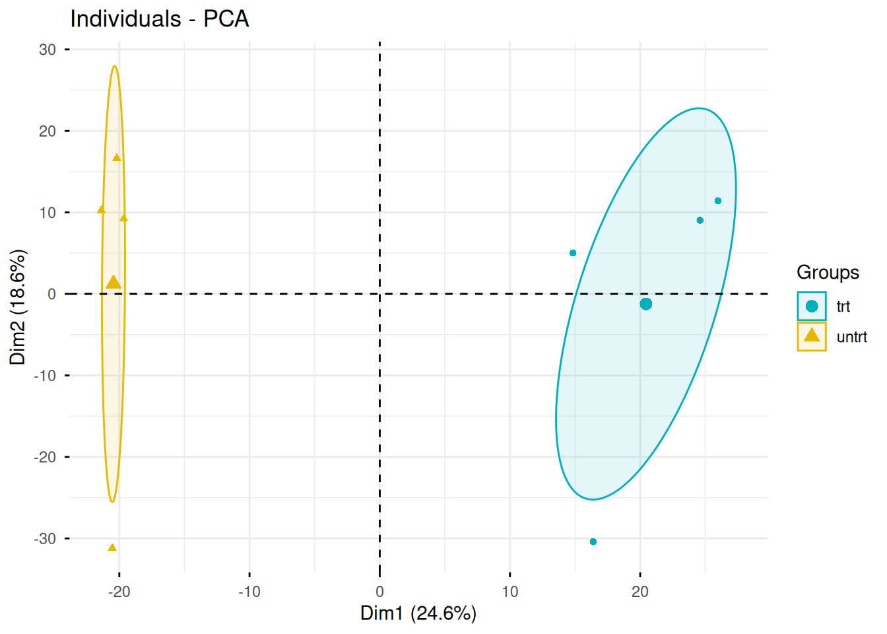
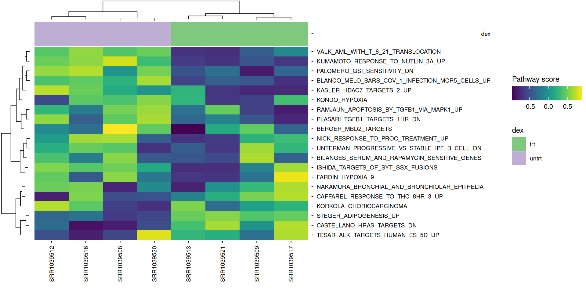
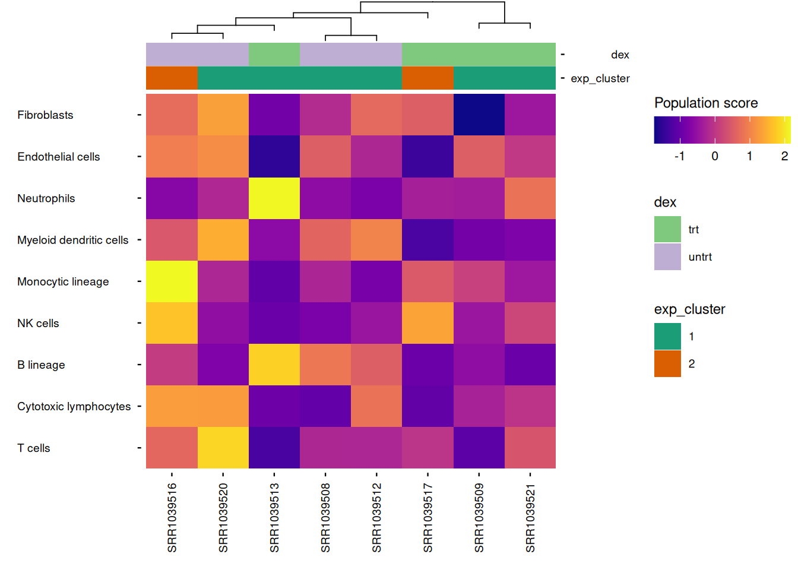

# Unsupervised RNA-seq analysis


As with the supervised example, we are using an open dataset which is
given by t he `airway` package. It provides a gene expression dataset
derived from **human bronchial epithelial cells**, treated or not with
**dexamethasone** (a corticosteroid).

Here is an example of how the **unsupervised** part of the `CAIBIrnaseq`
package can be used.

Code

``` r
library(airway)  
library(SummarizedExperiment)
library(CAIBIrnaseq)
library(tidyverse)
```

## Parameters

Code

``` r
species <- "Homo sapiens"   # Or "Mus musculus"

# Annotation variable to visualize
plot_annotations <- "dex"  # Put the name of the condition (here 'dex' is treated or untreated)

# Quality parameters
qc_min_nsamp <- 2
qc_min_gene_counts <- 10  

# Clustering of expression
exp_cluster <- data.frame(k = 2) #Number of cluster

# Clustering of metadata
metadata_clusters <- list(
  pathway_scores = data.frame(k = 2),
  microenv_scores = data.frame(k = 3)
)

# The following variables are those that will need to be modified depending on the analyses you want to do  

# Pathway collections 
pathway_collections <- c("CGP", "CP", "CP:KEGG_LEGACY", "Hallmark") #See the msigdb table and modify with the interesting collections

# Interesting genes
heatmap_genes <- list(
  gr_response_genes <- c("FKBP5", "TSC22D3", "PER1", "ZBTB16"),
  anti_inflam_genes <- c("DUSP1", "SOCS1", "MT2A")
)     # same here, replace with the genes you are interested in

heatmap_pathways <- c(
  "DUTERTRE_ESTRADIOL_RESPONSE_24HR_DN",
  "REN_ALVEOLAR_RHABDOMYOSARCOMA_DN",
  "NUYTTEN_EZH2_TARGETS_UP",
  "PASINI_SUZ12_TARGETS_DN"
) #Same

# Genes for the boxplots
boxplot_genes <- c("FKBP5", "TSC22D3")  #same

# Pathways for the boxplots
boxplot_pathways <- c(
  "KUMAMOTO_RESPONSE_TO_NUTLIN_3A_UP",
  "CASTELLANO_HRAS_TARGETS_DN"
) #same

# Corrélations entre gènes
correlation_genes <- list(
  c("FKBP5", "TSC22D3"),
  c("FKBP5", "ZBTB16")
)

# Pathways correlation
correlation_pathways <- list(
  c("DUTERTRE_ESTRADIOL_RESPONSE_24HR_DN", "REN_ALVEOLAR_RHABDOMYOSARCOMA_DN"),
  c("REN_ALVEOLAR_RHABDOMYOSARCOMA_DN", "NUYTTEN_EZH2_TARGETS_UP")
)   #same
```

## Load data

This section loads the RNA-seq dataset for analysis. It ensures the
correct input file is used, as specified in the parameters. rebase_gexp

Ensure your dataset is in a `Summarized Experiment` object, because all
the used functions below works with SummarizedExperiment input.

If you want to know more about this type of object, please click here:
[Bioconductor](https://bioconductor.org/packages/release/bioc/vignettes/SummarizedExperiment/inst/doc/SummarizedExperiment.html)

Code

``` r
data(airway, package="airway")
exp_data <- airway

# If you are using your own dataset .RDS file), use this command line : 
# exp_data <- readRDS(data_file)
```

Even if the datasets are globally build the same way, the names of the
variables are not exactly the same, so if we want to keep the same code,
we need to redefine a bit the variables.

If you want to know what are the used variables in this part, run this
command line : `colnames(SummarizedExperiment::rowData(exp_data))`

You should have these variables (with these exact same names):  
- **gene_name** : The commonly used symbol or name for the gene (e.g.,
A1BG).  
- **gene_id** : A unique and stable identifier for the gene, often from
databases like Ensembl.  
- **gene_length_kb** : The length of the gene measured in kilobases  
- **gene_description** : A brief textual summary of the gene’s function
or characteristics. - **gene_biotype** : A classification of the gene
based on its biological function or transcript type, such as
protein_coding, lncRNA, or pseudogene.

If you are using the notebook that Clarice GROENEVELD created to convert
a .xls file into a .RDS one, you can SKIP the next cell. If not, you
should look at how your dataset is defined. You might need to run some
command line as the following ones:

Code

``` r
library(biomaRt)

rowData(exp_data)$gene_length_kb <- 
  (rowData(exp_data)$gene_seq_end - rowData(exp_data)$gene_seq_start) / 1000

mart <- useEnsembl("ensembl", dataset = "hsapiens_gene_ensembl")
gene_ids <- rowData(exp_data)$gene_id

annot <- getBM(attributes = c("ensembl_gene_id", "description"),
               filters = "ensembl_gene_id",
               values = gene_ids,
               mart = mart)

matched <- match(rowData(exp_data)$gene_id, annot$ensembl_gene_id)
rowData(exp_data)$gene_description <- annot$description[matched]
```

## Pre-processing

Most datasets use ensembl gene ID by default after alignment, so this
step rebases the expression data to gene names. This ensures consistency
in naming for downstream analyses.

Code

``` r
exp_data <- rebase_gexp(exp_data, keep_cols = c("gene_name", "gene_id", 
                                                "gene_biotype", "gene_length_kb"))
```

### Filter

Here, we filter out genes expressed in too few samples or with very low
counts. This removes noise from the data and focuses on meaningful gene
expressions.

Code

``` r
exp_data <- filter_gexp(exp_data,
                        min_nsamp = 1, 
                        min_counts = 1)
```

Visualization of the filtering process to ensure the criteria applied
align with the dataset’s characteristics:

Code

``` r
colData(exp_data)$sample_id <- colnames(exp_data)
plot_qc_filters(exp_data)
```

### Normalize

Here, we apply a normalization to the expression data, making samples
comparable by reducing variability due to technical differences. For
datasets with few samples, `rlog` is the preferred normalization and
when more samples are present, `vst` is applied.

Code

``` r
exp_data <- normalize_gexp(exp_data)
```

## PCA

Principal component analysis (PCA) identifies the major patterns in the
dataset. These patterns help explore similarities or differences among
samples based on gene expression.

Code

``` r
pca_res = pca_gexp(exp_data)
exp_data@metadata[["pca_res"]] <- pca_res

annotations <- setdiff(plot_annotations, c("exp_cluster", "path_cluster"))
plot_pca(exp_data, color = plot_annotations)
```

If you want something more visual, you can add a circular/oval shape to
circle the different genotypes of samples, use the `fviz_pca_ind`
function from the `factoextra` package. With this dataset, it is not
relevant but it can be with your persona dataset. Here, it highlights
the fact that the 2 groups are not crossing each other. The `trt` group
has more PC1, whereas the `untrt` group has less. We could conclude that
PC1 is more represented in the treated samples.

Code

``` r
library(factoextra)
groups <- SummarizedExperiment::colData(exp_data)$dex  # here we want to split in function of `treated` and `untreated`

fviz_pca_ind(pca_res,
             geom = "point",
             habillage = groups,
             palette = c("#00AFBB", "#E7B800"),  # Personalized colors
             addEllipses = TRUE,
             ellipse.type = "confidence",
             repel = TRUE,
             label = "none"
)
```

[](https://crcordeliers.github.io/CAIBIrnaseq/articles/unsup_rnaseq_files/figure-html/unnamed-chunk-5-1.png)

## Unsupervised clustering

Here, we group samples based on expression patterns without prior
knowledge using hierarchical clustering on either a selected gene list
from the parameters or, by default, the 2000 most highly expressed
genes.

This can be useful for discovering sample subgroups or new biological
insights.

Code

``` r
exp_data <- cluster_exp(exp_data, k = exp_cluster$k, genes = exp_cluster$genes, n_pcs = 3)
```

Visual representation of expression levels for HVG across clusters,
highlighting distinct patterns.

Code

``` r
hvg <- highly_variable_genes(exp_data)
exp_cluster <- data.frame(k = 2)
hm <- plot_exp_heatmap(exp_data,  genes = hvg, 
                 annotations = c(plot_annotations, "exp_cluster"),
                 show_rownames = FALSE,
                 hm_color_limits = c(-2,2),
                 fname = "results/unsup/clustering/heatmap_2000hvg_exp_cluster.pdf")
hm
```

[](https://crcordeliers.github.io/CAIBIrnaseq/articles/unsup_rnaseq_files/figure-html/plot%20hvg-1.png)

## Pathway activity

Pathway analysis enables us to understand the functional implications of
gene expression changes. Here, we analyze the dataset for pathway
activity using two methods.

### PROGENy

PROGENy is a collection of only 14 core pathway responsive genes from
large signaling perturbation experiments. For more information see the
[original paper](https://www.nature.com/articles/s41467-017-02391-6).

The returned plot will give us information about the pathways that are
activated for each sample. There is especially one pathway that is
highly activated : `EGFR` , in the sample `SRR1039517`

Code

``` r
progeny_scores <- score_progeny(exp_data, species = "Homo sapiens")
```

Code

``` r
progeny_scores <- score_progeny(exp_data, species = "Homo sapiens")

metadata(exp_data)[["progeny_scores"]] <- progeny_scores   

plot_progeny_heatmap(exp_data, annotations = plot_annotations,
                     fname = "results/unsup/pathways/hm_progeny_scores.pdf")
```

    Called from: prep_scores_hm(exp_data, progeny_scores)
    debug: samp_annot <- as.data.frame(colData(exp_data))
    debug: if ("sample_id" %in% colnames(samp_annot)) {
        warning("'sample_id' already exists in colData and will be overwritten.")
        samp_annot <- samp_annot[, colnames(samp_annot) != "sample_id"]
    }
    debug: warning("'sample_id' already exists in colData and will be overwritten.")

    debug: samp_annot <- samp_annot[, colnames(samp_annot) != "sample_id"]
    debug: samp_annot <- rownames_to_column(samp_annot, "sample_id")
    debug: path_table <- as.data.frame(t(pathway_scores[feats, , drop = FALSE]))
    debug: if ("sample_id" %in% colnames(path_table)) {
        warning("'sample_id' already exists in `pathway_scores` and will be overwritten.")
        path_table <- path_table[, colnames(path_table) != "sample_id"]
    }
    debug: path_table <- rownames_to_column(path_table, "sample_id")
    debug: path_table <- dplyr::left_join(path_table, samp_annot, by = "sample_id")
    debug: hm_data <- list(table = path_table, colv = "sample_id", rowv = feats)
    debug: return(hm_data)

[](https://crcordeliers.github.io/CAIBIrnaseq/articles/unsup_rnaseq_files/figure-html/progenyprovided-1.png)

Code

``` r
write.csv(progeny_scores, file = "results/unsup/pathways/progeny_scores.csv")
```

### Pathways

Ensure your dataset is in a `Summarized Experiment` object, because all
the used functions below works with SummarizedExperiment input.

Pathway collections available in the MSIGdb can be specified in the
parameters. These pathways are scored and ranked by their variance in
the data. These are the available collections (use `gs_subcollection` as
name except for Hallmarks, which should be ‘H’).

Code

``` r
library(msigdbr)
library(dplyr)
library(kableExtra)


msigdbr::msigdbr_collections() |>
  kableExtra::kbl() |>
  kableExtra::kable_styling() |>
  kableExtra::scroll_box(height = "300px")
```

| db_version | gs_collection | gs_subcollection | gs_collection_name                   | num_genesets |
|:-----------|:--------------|:-----------------|:-------------------------------------|-------------:|
| 2026.1.Hs  | C1            |                  | Positional                           |          302 |
| 2026.1.Hs  | C2            | CGP              | Chemical and Genetic Perturbations   |         3555 |
| 2026.1.Hs  | C2            | CP               | Canonical Pathways                   |           19 |
| 2026.1.Hs  | C2            | CP:BIOCARTA      | BioCarta Pathways                    |          292 |
| 2026.1.Hs  | C2            | CP:KEGG_LEGACY   | KEGG Legacy Pathways                 |          186 |
| 2026.1.Hs  | C2            | CP:KEGG_MEDICUS  | KEGG Medicus Pathways                |          658 |
| 2026.1.Hs  | C2            | CP:PID           | PID Pathways                         |          196 |
| 2026.1.Hs  | C2            | CP:REACTOME      | Reactome Pathways                    |         1839 |
| 2026.1.Hs  | C2            | CP:WIKIPATHWAYS  | WikiPathways                         |          925 |
| 2026.1.Hs  | C3            | MIR:MIRDB        | miRDB                                |         2377 |
| 2026.1.Hs  | C3            | MIR:MIR_LEGACY   | MIR_Legacy                           |          221 |
| 2026.1.Hs  | C3            | TFT:GTRD         | GTRD                                 |          506 |
| 2026.1.Hs  | C3            | TFT:TFT_LEGACY   | TFT_Legacy                           |          610 |
| 2026.1.Hs  | C4            | 3CA              | Curated Cancer Cell Atlas gene sets  |          148 |
| 2026.1.Hs  | C4            | CGN              | Cancer Gene Neighborhoods            |          427 |
| 2026.1.Hs  | C4            | CM               | Cancer Modules                       |          431 |
| 2026.1.Hs  | C5            | GO:BP            | GO Biological Process                |         7538 |
| 2026.1.Hs  | C5            | GO:CC            | GO Cellular Component                |         1080 |
| 2026.1.Hs  | C5            | GO:MF            | GO Molecular Function                |         1872 |
| 2026.1.Hs  | C5            | HPO              | Human Phenotype Ontology             |         5793 |
| 2026.1.Hs  | C6            |                  | Oncogenic Signature                  |          189 |
| 2026.1.Hs  | C7            | IMMUNESIGDB      | ImmuneSigDB                          |         4872 |
| 2026.1.Hs  | C7            | VAX              | HIPC Vaccine Response                |          347 |
| 2026.1.Hs  | C8            |                  | Cell Type Signature                  |          866 |
| 2026.1.Hs  | C9            |                  | Computational Perturbation Signature |           62 |
| 2026.1.Hs  | H             |                  | Hallmark                             |           50 |

Code

``` r
pathways <- get_annotation_collection(pathway_collections, 
                                      species = species)
pathway_scores <- score_pathways(exp_data, pathways, verbose = FALSE)
metadata(exp_data)[["pathway_scores"]] <- pathway_scores

collections <- pathway_collections |> 
  paste(collapse = "_") |>
  stringr::str_remove("\\:")

plot_pathway_heatmap(exp_data, annotations = plot_annotations,
                    fwidth = 9,
                    fname = stringr::str_glue(
                      "results/unsup/pathways/hm_paths_{collections}_top20.pdf")
                    )
```

    Called from: prep_scores_hm(exp_data, pathway_scores, pathways)
    debug: samp_annot <- as.data.frame(colData(exp_data))
    debug: if ("sample_id" %in% colnames(samp_annot)) {
        warning("'sample_id' already exists in colData and will be overwritten.")
        samp_annot <- samp_annot[, colnames(samp_annot) != "sample_id"]
    }
    debug: warning("'sample_id' already exists in colData and will be overwritten.")

    debug: samp_annot <- samp_annot[, colnames(samp_annot) != "sample_id"]
    debug: samp_annot <- rownames_to_column(samp_annot, "sample_id")
    debug: path_table <- as.data.frame(t(pathway_scores[feats, , drop = FALSE]))
    debug: if ("sample_id" %in% colnames(path_table)) {
        warning("'sample_id' already exists in `pathway_scores` and will be overwritten.")
        path_table <- path_table[, colnames(path_table) != "sample_id"]
    }
    debug: path_table <- rownames_to_column(path_table, "sample_id")
    debug: path_table <- dplyr::left_join(path_table, samp_annot, by = "sample_id")
    debug: hm_data <- list(table = path_table, colv = "sample_id", rowv = feats)
    debug: return(hm_data)

[](https://crcordeliers.github.io/CAIBIrnaseq/articles/unsup_rnaseq_files/figure-html/pathways-1.png)

Code

``` r
write.csv(pathways, file = stringr::str_glue("results/unsup/pathways/paths_{collections}.csv"))
```

## Microenvironment scores

This step calculates immune and stromal cell type abundances using
MCPcounter or mMCPcounter. It helps to infer the composition of the
tumor microenvironment or similar contexts.

Code

``` r
mcp_scores <- mcp_counter(exp_data, species = species)
S4Vectors::metadata(exp_data)[["microenv_scores"]] <- mcp_scores

plot_microenv_heatmap(exp_data, annotations = c("dex", "exp_cluster"),
                      fname = "results/unsup/tme/heatSmap_mcpcounter.pdf")
```

    Called from: prep_scores_hm(exp_data, microenv_scores)
    debug: samp_annot <- as.data.frame(colData(exp_data))
    debug: if ("sample_id" %in% colnames(samp_annot)) {
        warning("'sample_id' already exists in colData and will be overwritten.")
        samp_annot <- samp_annot[, colnames(samp_annot) != "sample_id"]
    }
    debug: warning("'sample_id' already exists in colData and will be overwritten.")

    debug: samp_annot <- samp_annot[, colnames(samp_annot) != "sample_id"]
    debug: samp_annot <- rownames_to_column(samp_annot, "sample_id")
    debug: path_table <- as.data.frame(t(pathway_scores[feats, , drop = FALSE]))
    debug: if ("sample_id" %in% colnames(path_table)) {
        warning("'sample_id' already exists in `pathway_scores` and will be overwritten.")
        path_table <- path_table[, colnames(path_table) != "sample_id"]
    }
    debug: path_table <- rownames_to_column(path_table, "sample_id")
    debug: path_table <- dplyr::left_join(path_table, samp_annot, by = "sample_id")
    debug: hm_data <- list(table = path_table, colv = "sample_id", rowv = feats)
    debug: return(hm_data)

[](https://crcordeliers.github.io/CAIBIrnaseq/articles/unsup_rnaseq_files/figure-html/microenvironment-1.png)

Code

``` r
write.csv(mcp_scores, file = "results/unsup/tme/scores_mcpcounter.csv")
```

By default, the rows are order by scores. But, the
`plot_microenv_heatsmap` function has the `ellipsis argument`. That
means that this function can have a wide range of inputs. So, it is
possible to plot the rows in a different order than the default one :

Code

``` r
plot_microenv_heatmap(exp_data,
                      annotations = c("dex", "exp_cluster"),
                      fname = "results/unsup/tme/heatmap_sorted_bydex.pdf",
                      cluster_rows = FALSE)
```

    Called from: prep_scores_hm(exp_data, microenv_scores)
    debug: samp_annot <- as.data.frame(colData(exp_data))
    debug: if ("sample_id" %in% colnames(samp_annot)) {
        warning("'sample_id' already exists in colData and will be overwritten.")
        samp_annot <- samp_annot[, colnames(samp_annot) != "sample_id"]
    }
    debug: warning("'sample_id' already exists in colData and will be overwritten.")

    debug: samp_annot <- samp_annot[, colnames(samp_annot) != "sample_id"]
    debug: samp_annot <- rownames_to_column(samp_annot, "sample_id")
    debug: path_table <- as.data.frame(t(pathway_scores[feats, , drop = FALSE]))
    debug: if ("sample_id" %in% colnames(path_table)) {
        warning("'sample_id' already exists in `pathway_scores` and will be overwritten.")
        path_table <- path_table[, colnames(path_table) != "sample_id"]
    }
    debug: path_table <- rownames_to_column(path_table, "sample_id")
    debug: path_table <- dplyr::left_join(path_table, samp_annot, by = "sample_id")
    debug: hm_data <- list(table = path_table, colv = "sample_id", rowv = feats)
    debug: return(hm_data)

[](https://crcordeliers.github.io/CAIBIrnaseq/articles/unsup_rnaseq_files/figure-html/unnamed-chunk-7-1.png)

## Targeted plots

This section focuses on visualizing specific genes or pathways of
interest, as specified in the parameters.

### Heatmaps

Generates heatmaps for pre-selected genes of interest to observe their
expression across samples or conditions.

Code

``` r
hms <- lapply(1:length(heatmap_genes), function(i) {
  gene_annot <- SummarizedExperiment::rowData(exp_data)
  genes <- heatmap_genes[[i]]
  name <- ifelse(is.null(names(heatmap_genes)), i, names(heatmap_genes)[i])
  plot_exp_heatmap(exp_data, genes = genes, 
                   annotations = plot_annotations,
                   fname = stringr::str_glue("results/unsup/targeted/hm_genes_{i}.pdf"))
})
patchwork::wrap_plots(hms, ncol = 2, guides = "collect")
```

[](https://crcordeliers.github.io/CAIBIrnaseq/articles/unsup_rnaseq_files/figure-html/plot_hm_genes-1.png)

#### Selected pathways

Code

``` r
valid_pathways <- intersect(heatmap_pathways, rownames(pathway_scores))

plot_pathway_heatmap(exp_data, 
                     annotations = plot_annotations, 
                     pathways = valid_pathways,
                     fname = stringr::str_glue("results/unsup/targeted/hm_pathways_selected.pdf"))
```

    Called from: prep_scores_hm(exp_data, pathway_scores, pathways)
    debug: samp_annot <- as.data.frame(colData(exp_data))
    debug: if ("sample_id" %in% colnames(samp_annot)) {
        warning("'sample_id' already exists in colData and will be overwritten.")
        samp_annot <- samp_annot[, colnames(samp_annot) != "sample_id"]
    }
    debug: warning("'sample_id' already exists in colData and will be overwritten.")

    debug: samp_annot <- samp_annot[, colnames(samp_annot) != "sample_id"]
    debug: samp_annot <- rownames_to_column(samp_annot, "sample_id")
    debug: path_table <- as.data.frame(t(pathway_scores[feats, , drop = FALSE]))
    debug: if ("sample_id" %in% colnames(path_table)) {
        warning("'sample_id' already exists in `pathway_scores` and will be overwritten.")
        path_table <- path_table[, colnames(path_table) != "sample_id"]
    }
    debug: path_table <- rownames_to_column(path_table, "sample_id")
    debug: path_table <- dplyr::left_join(path_table, samp_annot, by = "sample_id")
    debug: hm_data <- list(table = path_table, colv = "sample_id", rowv = feats)
    debug: return(hm_data)

[](https://crcordeliers.github.io/CAIBIrnaseq/articles/unsup_rnaseq_files/figure-html/plot_hm_pathways-1.png)

### Compare clusters

Boxplots provide a clear comparison of expression levels across
experimental groups or conditions.

#### Selected genes

Code

``` r
genes <- boxplot_genes
annotations <- plot_annotations

boxplots <- lapply(genes, function(gene) {
  lapply(annotations, function(annotation) {
    plt <- plot_exp_boxplot(exp_data, gene = gene, 
                   annotation = annotation, 
                   color_var = annotation, 
                   pt_size = 2,
                   fname = stringr::str_glue("results/unsup/targeted/boxplots/box_{gene}_{annotation}.pdf"))
  })
}) |> purrr::flatten()
```

Code

``` r
patchwork::wrap_plots(boxplots, nrows = round(length(boxplots)/2), guides = "collect")
```

[](https://crcordeliers.github.io/CAIBIrnaseq/articles/unsup_rnaseq_files/figure-html/plot_box_genes2-1.png)

#### Selected pathways

Code

``` r
paths <- boxplot_pathways
annotations <- plot_annotations

boxplots <- lapply(paths, function(path) {
  lapply(annotations, function(annotation) {
    plt <- plot_pathway_boxplot(exp_data, 
                             pathway = path,
                   annotation = annotation, 
                   color_var = annotation, 
                   pt_size = 2,
                   fname = stringr::str_glue("results/unsup/targeted/boxplots/box_{path}_{annotation}.pdf"))
  })
}) |> purrr::flatten()
```

Code

``` r
patchwork::wrap_plots(boxplots, nrows = round(length(boxplots)/2), guides = "collect")
```

[](https://crcordeliers.github.io/CAIBIrnaseq/articles/unsup_rnaseq_files/figure-html/plot_box_paths2-1.png)

#### Selected pathways

Correlation plots for selected pathways can help identify similarities
or differences in pathway activity patterns across samples. Each pathway
pair is plotted separately and color-coded by sample annotation to
illustrate trends within each condition.

Code

``` r
path_pairs <-correlation_pathways
annotations <- plot_annotations

cor_plts <- lapply(path_pairs, function(path_pair) {
  lapply(annotations, function(annot) {
      plot_pathway_scatter(exp_data, 
                   pathway1 = path_pair[1],
                   pathway2 = path_pair[2],## Call `lifecycle::last_lifecycle_warnings()` to see where this warning was 
                   color_var = annot,
                   fname = stringr::str_glue(
                     "results/unsup/targeted/correlations/cor_{path_pair[1]}_{path_pair[2]}_color={annot}.pdf"))
  })
}) |> purrr::flatten()
```

Code

``` r
patchwork::wrap_plots(cor_plts, nrows = round(length(cor_plts)/2), guides = "collect")
```

[](https://crcordeliers.github.io/CAIBIrnaseq/articles/unsup_rnaseq_files/figure-html/plot_correlation_paths2-1.png)

## Cluster using metadata

Code

``` r
types = names(metadata_clusters)

for(type in types) {
  exp_data <- cluster_metadata(exp_data, 
                   metadata_name = type, 
                   k = metadata_clusters[[type]]$k, 
                   features = metadata_clusters[[type]]$features,
                   n_pcs = 3 )
}
```

## Save SummarizedExperiment

The final step saves the processed dataset and results. This ensures all
outputs can be revisited or shared for further analysis.

Code

``` r
saveRDS(exp_data, file = stringr::str_glue("results/unsup/data_SummarizedExp_{lubridate::today()}.RDS"))
```

## Report parameters

For reproducibility, the parameters used in the analysis and the
computational environment details are documented.

### sessionInfo

The [`sessionInfo()`](https://rdrr.io/r/utils/sessionInfo.html) prints
out all packages loaded at the time of analysis, as well as their
versions.

Code

``` r
sessionInfo()
```

    R version 4.5.2 (2025-10-31)
    Platform: x86_64-pc-linux-gnu
    Running under: Ubuntu 24.04.4 LTS

    Matrix products: default
    BLAS:   /usr/lib/x86_64-linux-gnu/openblas-pthread/libblas.so.3
    LAPACK: /usr/lib/x86_64-linux-gnu/openblas-pthread/libopenblasp-r0.3.26.so;  LAPACK version 3.12.0

    locale:
     [1] LC_CTYPE=en_US.UTF-8       LC_NUMERIC=C
     [3] LC_TIME=en_US.UTF-8        LC_COLLATE=en_US.UTF-8
     [5] LC_MONETARY=en_US.UTF-8    LC_MESSAGES=en_US.UTF-8
     [7] LC_PAPER=en_US.UTF-8       LC_NAME=C
     [9] LC_ADDRESS=C               LC_TELEPHONE=C
    [11] LC_MEASUREMENT=en_US.UTF-8 LC_IDENTIFICATION=C

    time zone: Europe/Paris
    tzcode source: system (glibc)

    attached base packages:
    [1] stats4    stats     graphics  grDevices utils     datasets  methods
    [8] base

    other attached packages:
     [1] kableExtra_1.4.0            msigdbr_26.1.0
     [3] factoextra_2.0.0            biomaRt_2.64.0
     [5] lubridate_1.9.5             forcats_1.0.1
     [7] stringr_1.6.0               dplyr_1.2.0
     [9] purrr_1.2.1                 readr_2.2.0
    [11] tidyr_1.3.2                 tibble_3.3.1
    [13] ggplot2_4.0.2               tidyverse_2.0.0
    [15] CAIBIrnaseq_1.0.3           R.utils_2.13.0
    [17] R.oo_1.27.1                 R.methodsS3_1.8.2
    [19] airway_1.28.0               SummarizedExperiment_1.38.1
    [21] Biobase_2.68.0              GenomicRanges_1.60.0
    [23] GenomeInfoDb_1.44.3         IRanges_2.42.0
    [25] S4Vectors_0.46.0            BiocGenerics_0.54.1
    [27] generics_0.1.4              MatrixGenerics_1.20.0
    [29] matrixStats_1.5.0

    loaded via a namespace (and not attached):
      [1] ggplotify_0.1.3             filelock_1.0.3
      [3] graph_1.86.0                XML_3.99-0.23
      [5] lifecycle_1.0.5             httr2_1.2.2
      [7] rstatix_0.7.3               lattice_0.22-9
      [9] crosstalk_1.2.2             backports_1.5.0
     [11] magrittr_2.0.4              plotly_4.12.0
     [13] rmarkdown_2.30              yaml_2.3.12
     [15] rlist_0.4.6.2               otel_0.2.0
     [17] cowplot_1.2.0               DBI_1.3.0
     [19] RColorBrewer_1.1-3          eulerr_7.0.4
     [21] abind_1.4-8                 yulab.utils_0.2.4
     [23] rappdirs_0.3.4              GenomeInfoDbData_1.2.14
     [25] ggrepel_0.9.8               irlba_2.3.7
     [27] tidytree_0.4.7              GSVA_2.2.1
     [29] MCPcounter_1.2.0            annotate_1.86.1
     [31] svglite_2.2.2               codetools_0.2-20
     [33] DelayedArray_0.34.1         xml2_1.5.2
     [35] tidyselect_1.2.1            aplot_0.2.9
     [37] UCSC.utils_1.4.0            farver_2.1.2
     [39] ScaledMatrix_1.16.0         BiocFileCache_2.16.2
     [41] jsonlite_2.0.0              Formula_1.2-5
     [43] systemfonts_1.3.2           tools_4.5.2
     [45] progress_1.2.3              ragg_1.5.1
     [47] treeio_1.33.0               Rcpp_1.1.1
     [49] glue_1.8.0                  gridExtra_2.3
     [51] SparseArray_1.8.1           xfun_0.56
     [53] DESeq2_1.48.2               HDF5Array_1.36.0
     [55] withr_3.0.2                 fastmap_1.2.0
     [57] rhdf5filters_1.20.0         digest_0.6.39
     [59] rsvd_1.0.5                  timechange_0.4.0
     [61] R6_2.6.1                    gridGraphics_0.5-1
     [63] textshaping_1.0.5           dichromat_2.0-0.1
     [65] RSQLite_2.4.6               h5mread_1.0.1
     [67] data.table_1.18.2.1         prettyunits_1.2.0
     [69] httr_1.4.8                  htmlwidgets_1.6.4
     [71] S4Arrays_1.8.1              pkgconfig_2.0.3
     [73] gtable_0.3.6                progeny_1.30.0
     [75] blob_1.3.0                  S7_0.2.1
     [77] SingleCellExperiment_1.30.1 XVector_0.48.0
     [79] htmltools_0.5.9             carData_3.0-6
     [81] fgsea_1.34.2                GSEABase_1.70.1
     [83] scales_1.4.0                png_0.1-9
     [85] SpatialExperiment_1.18.1    ggfun_0.2.0
     [87] rstudioapi_0.18.0           knitr_1.51
     [89] tzdb_0.5.0                  reshape2_1.4.5
     [91] rjson_0.2.23                nlme_3.1-168
     [93] curl_7.0.0                  cachem_1.1.0
     [95] rhdf5_2.52.1                parallel_4.5.2
     [97] vipor_0.4.7                 AnnotationDbi_1.70.0
     [99] pillar_1.11.1               grid_4.5.2
    [101] vctrs_0.7.1                 ggpubr_0.6.3
    [103] BiocSingular_1.24.0         car_3.1-5
    [105] dbplyr_2.5.2                beachmat_2.24.0
    [107] xtable_1.8-8                beeswarm_0.4.0
    [109] evaluate_1.0.5              magick_2.9.1
    [111] cli_3.6.5                   locfit_1.5-9.12
    [113] compiler_4.5.2              rlang_1.1.7
    [115] crayon_1.5.3                ggsignif_0.6.4
    [117] labeling_0.4.3              plyr_1.8.9
    [119] fs_1.6.7                    ggbeeswarm_0.7.3
    [121] stringi_1.8.7               viridisLite_0.4.3
    [123] BiocParallel_1.42.2         assertthat_0.2.1
    [125] babelgene_22.9              Biostrings_2.76.0
    [127] lazyeval_0.2.2              ggheatmapper_1.0.1
    [129] Matrix_1.7-4                hms_1.1.4
    [131] patchwork_1.3.2             sparseMatrixStats_1.20.0
    [133] bit64_4.6.0-1               Rhdf5lib_1.30.0
    [135] KEGGREST_1.48.1             broom_1.0.12
    [137] memoise_2.0.1               ggtree_3.16.3
    [139] fastmatch_1.1-8             bit_4.6.0
    [141] ape_5.8-1                  
