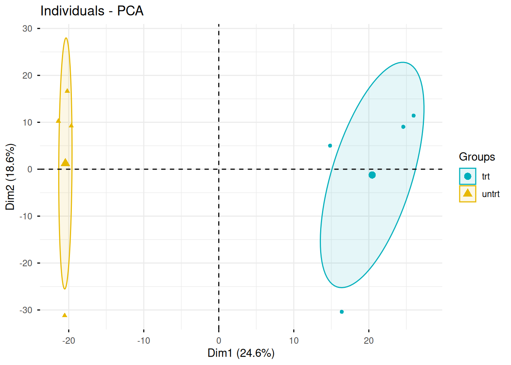
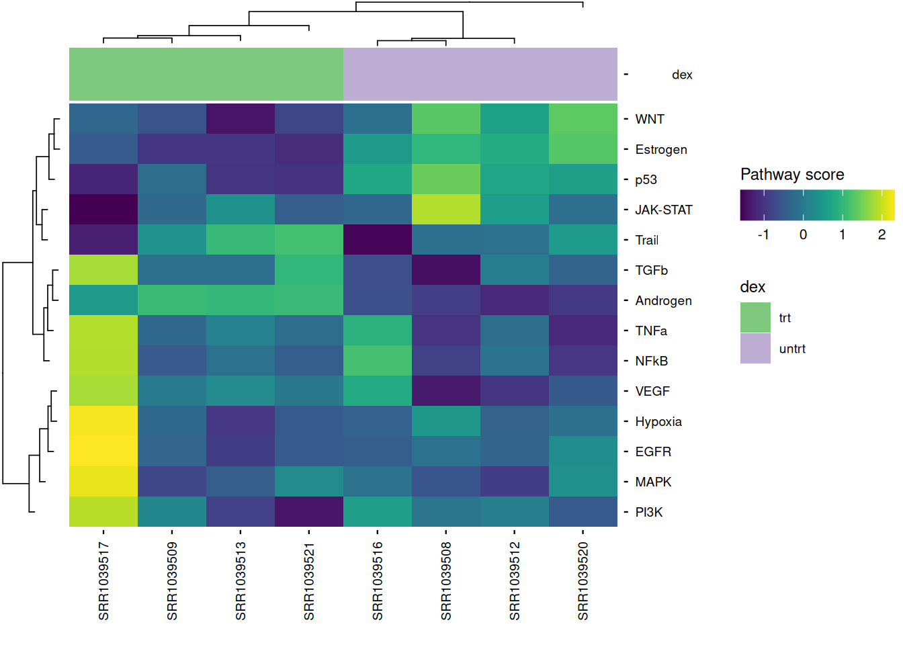
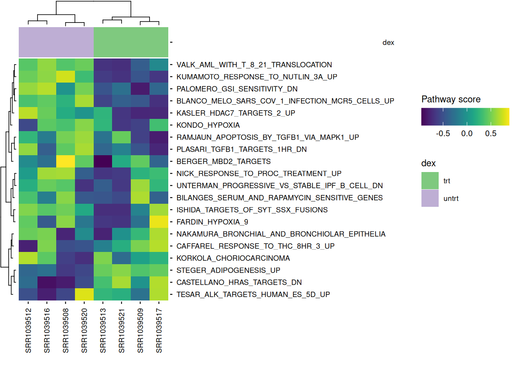
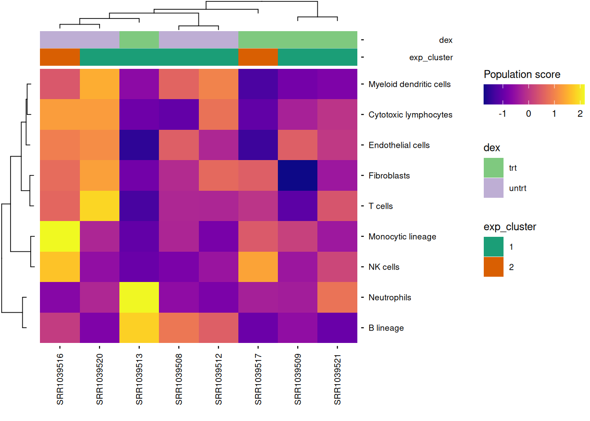
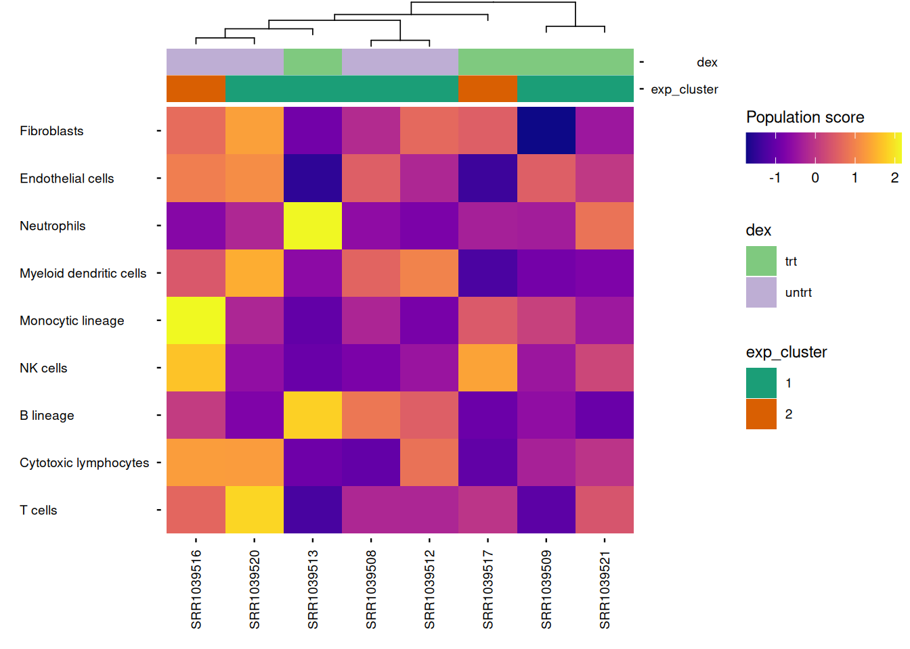
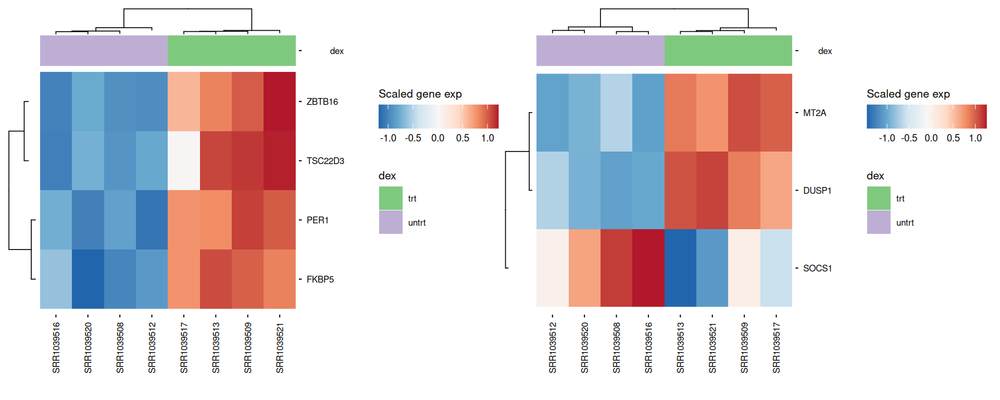
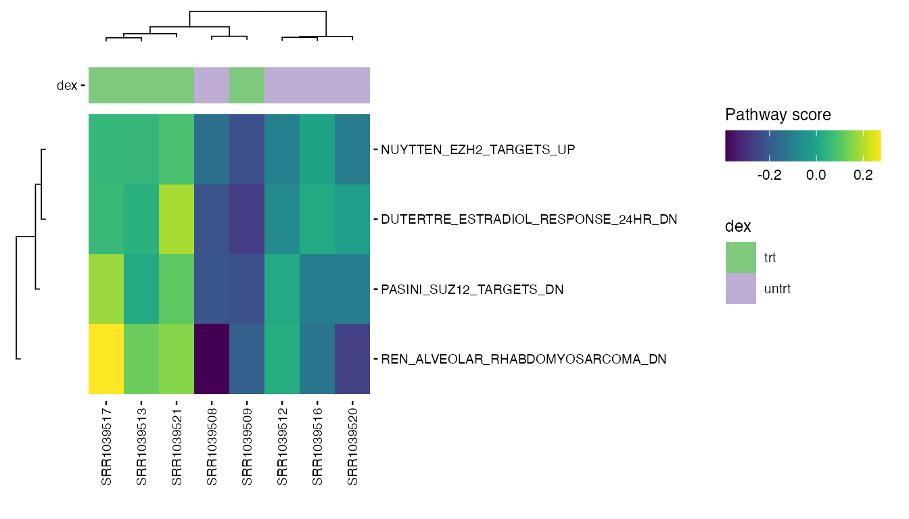
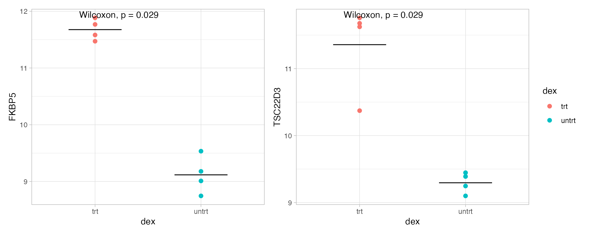
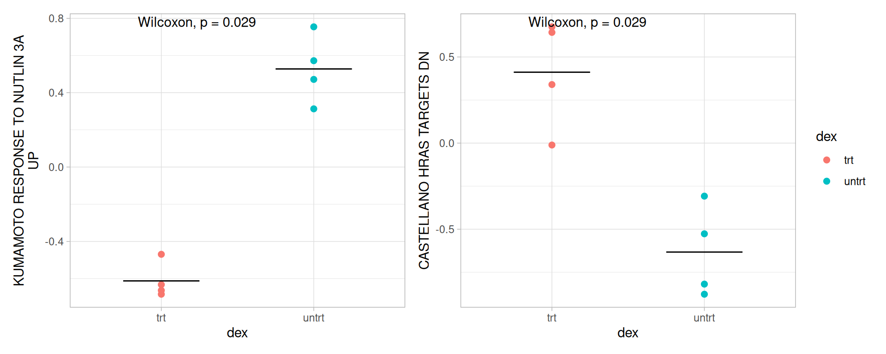
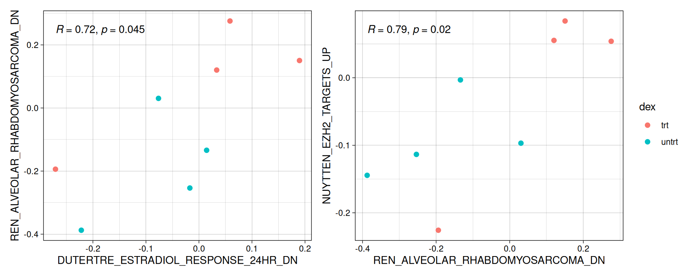

# Unsupervised RNA-seq analysis


As with the supervised example, we are using an open dataset which is
given by t he `airway` package. It provides a gene expression dataset
derived from **human bronchial epithelial cells**, treated or not with
**dexamethasone** (a corticosteroid).

Here is an example of how the **unsupervised** part of the `CAIBIrnaseq`
package can be used.

Code

``` r
library(airway)  
library(SummarizedExperiment)
library(CAIBIrnaseq)
library(tidyverse)
```

As you go through the notebook, you’ll define a few variables along the
way (gene/pathway names, grouping variables, etc.) right before the step
that uses them, so you can adapt each one to your own dataset without
hunting through the surrounding code.

## Load data

This section loads the RNA-seq dataset for analysis. rebase_gexp

Ensure your dataset is in a `Summarized Experiment` object, because all
the used functions below works with SummarizedExperiment input.

If you want to know more about this type of object, please click here:
[Bioconductor](https://bioconductor.org/packages/release/bioc/vignettes/SummarizedExperiment/inst/doc/SummarizedExperiment.html)

Code

``` r
data(airway, package="airway")
exp_data <- airway

# If you are using your own dataset .RDS file), use this command line : 
# exp_data <- readRDS(data_file)
```

Even if the datasets are globally build the same way, the names of the
variables are not exactly the same, so if we want to keep the same code,
we need to redefine a bit the variables.

If you want to know what are the used variables in this part, run this
command line : `colnames(SummarizedExperiment::rowData(exp_data))`

You should have these variables (with these exact same names):  
- **gene_name** : The commonly used symbol or name for the gene (e.g.,
A1BG).  
- **gene_id** : A unique and stable identifier for the gene, often from
databases like Ensembl.  
- **gene_length_kb** : The length of the gene measured in kilobases  
- **gene_description** : A brief textual summary of the gene’s function
or characteristics. - **gene_biotype** : A classification of the gene
based on its biological function or transcript type, such as
protein_coding, lncRNA, or pseudogene.

Code

``` r
rowData(exp_data)$gene_length_kb <-
  (rowData(exp_data)$gene_seq_end - rowData(exp_data)$gene_seq_start) / 1000
```

Some datasets come with gene metadata already attached. If gene metadata
is missing, we can fetch it Ensembl’s BioMart. This requires a live
network connection; if BioMart is unreachable or incompatible with your
`biomaRt` version, this chunk may fail to run.

Code

``` r
library(biomaRt)

mart <- useEnsembl("ensembl", dataset = "hsapiens_gene_ensembl")
gene_ids <- rowData(exp_data)$gene_id

annot <- getBM(attributes = c("ensembl_gene_id", "gene_name"),
                filters = "ensembl_gene_id",
                values = gene_ids,
                mart = mart)

matched <- match(rowData(exp_data)$gene_id, annot$ensembl_gene_id)
rowData(exp_data)$gene_description <- annot$description[matched]
```

## Pre-processing

Most datasets use ensembl gene ID by default after alignment, so this
step rebases the expression data to gene names. This ensures consistency
in naming for downstream analyses.

Code

``` r
exp_data <- rebase_gexp(exp_data, keep_cols = c("gene_name", "gene_id", 
                                                "gene_biotype", "gene_length_kb"))
```

### Filter

Here, we filter out genes expressed in too few samples or with very low
counts. This removes noise from the data and focuses on meaningful gene
expressions.

Code

``` r
exp_data <- filter_gexp(exp_data,
                        min_nsamp = 1, 
                        min_counts = 1)
```

Visualization of the filtering process to ensure the criteria applied
align with the dataset’s characteristics:

Code

``` r
colData(exp_data)$sample_id <- colnames(exp_data)
plot_qc_filters(exp_data)
```

### Normalize

Here, we apply a normalization to the expression data, making samples
comparable by reducing variability due to technical differences. For
datasets with few samples, `rlog` is the preferred normalization and
when more samples are present, `vst` is applied.

Code

``` r
exp_data <- normalize_gexp(exp_data)
```

## PCA

Principal component analysis (PCA) identifies the major patterns in the
dataset. These patterns help explore similarities or differences among
samples based on gene expression.

We also define the grouping variable of interest here — the column in
`colData` representing our main condition of interest. We’ll reuse it
throughout the analysis to color and annotate the various plots below.

Code

``` r
group_var <- "dex"  # Put the name of the condition (here 'dex' is treated or untreated)

pca_res = pca_gexp(exp_data)
exp_data@metadata[["pca_res"]] <- pca_res

plot_pca(exp_data, color = group_var)
```

If you want something more visual, you can add a circular/oval shape to
circle the different genotypes of samples, use the `fviz_pca_ind`
function from the `factoextra` package. With this dataset, it is not
relevant but it can be with your persona dataset. Here, it highlights
the fact that the 2 groups are not crossing each other. The `trt` group
has more PC1, whereas the `untrt` group has less. We could conclude that
PC1 is more represented in the treated samples.

Code

``` r
library(factoextra)
groups <- SummarizedExperiment::colData(exp_data)$dex  # here we want to split in function of `treated` and `untreated`

fviz_pca_ind(pca_res,
             geom = "point",
             habillage = groups,
             palette = c("#00AFBB", "#E7B800"),  # Personalized colors
             addEllipses = TRUE,
             ellipse.type = "confidence",
             repel = TRUE,
             label = "none"
)
```

[](https://crcordeliers.github.io/CAIBIrnaseq/articles/unsup_rnaseq_files/figure-html/unnamed-chunk-6-1.png)

## Unsupervised clustering

Here, we group samples based on expression patterns without prior
knowledge using hierarchical clustering on either a selected gene list
or, by default, the 2000 most highly expressed genes.

This can be useful for discovering sample subgroups or new biological
insights.

We define the clustering parameters below (number of clusters, and
optionally the genes to cluster on):

Code

``` r
exp_cluster <- data.frame(k = 2) # Number of clusters
```

Code

``` r
exp_data <- cluster_exp(exp_data, k = exp_cluster$k, genes = exp_cluster$genes, n_pcs = 3)
```

Visual representation of expression levels for HVG across clusters,
highlighting distinct patterns.

Code

``` r
hvg <- highly_variable_genes(exp_data)
hm <- plot_exp_heatmap(exp_data,  genes = hvg,
                 annotations = c(group_var, "exp_cluster"),
                 show_rownames = FALSE,
                 hm_color_limits = c(-2,2),
                 fname = "results/unsup/clustering/heatmap_2000hvg_exp_cluster.pdf")
hm
```

[](https://crcordeliers.github.io/CAIBIrnaseq/articles/unsup_rnaseq_files/figure-html/plot%20hvg-1.png)

## Pathway activity

Pathway analysis enables us to understand the functional implications of
gene expression changes. Here, we analyze the dataset for pathway
activity using two methods.

### PROGENy

PROGENy is a collection of only 14 core pathway responsive genes from
large signaling perturbation experiments. For more information see the
[original paper](https://www.nature.com/articles/s41467-017-02391-6).

The returned plot will give us information about the pathways that are
activated for each sample. There is especially one pathway that is
highly activated : `EGFR` , in the sample `SRR1039517`

We also define the species here (matching your dataset’s organism) —
we’ll reuse it for the pathway and microenvironment analyses below.

Code

``` r
species <- "Homo sapiens"   # Or "Mus musculus"

progeny_scores <- score_progeny(exp_data, species = species)

metadata(exp_data)[["progeny_scores"]] <- progeny_scores

plot_progeny_heatmap(exp_data, annotations = group_var,
                     fname = "results/unsup/pathways/hm_progeny_scores.pdf")
```

    Called from: prep_scores_hm(exp_data, progeny_scores)
    debug: samp_annot <- as.data.frame(colData(exp_data))
    debug: if ("sample_id" %in% colnames(samp_annot)) {
        warning("'sample_id' already exists in colData and will be overwritten.")
        samp_annot <- samp_annot[, colnames(samp_annot) != "sample_id"]
    }
    debug: warning("'sample_id' already exists in colData and will be overwritten.")

    debug: samp_annot <- samp_annot[, colnames(samp_annot) != "sample_id"]
    debug: samp_annot <- rownames_to_column(samp_annot, "sample_id")
    debug: path_table <- as.data.frame(t(pathway_scores[feats, , drop = FALSE]))
    debug: if ("sample_id" %in% colnames(path_table)) {
        warning("'sample_id' already exists in `pathway_scores` and will be overwritten.")
        path_table <- path_table[, colnames(path_table) != "sample_id"]
    }
    debug: path_table <- rownames_to_column(path_table, "sample_id")
    debug: path_table <- dplyr::left_join(path_table, samp_annot, by = "sample_id")
    debug: hm_data <- list(table = path_table, colv = "sample_id", rowv = feats)
    debug: return(hm_data)

[](https://crcordeliers.github.io/CAIBIrnaseq/articles/unsup_rnaseq_files/figure-html/progenyprovided-1.png)

Code

``` r
write.csv(progeny_scores, file = "results/unsup/pathways/progeny_scores.csv")
```

### Pathways

Ensure your dataset is in a `Summarized Experiment` object, because all
the used functions below works with SummarizedExperiment input.

Pathway collections available in the MSIGdb can be specified below.
These pathways are scored and ranked by their variance in the data.
These are the available collections (use `gs_subcollection` as name
except for Hallmarks, which should be ‘H’).

Code

``` r
library(msigdbr)
library(dplyr)
library(kableExtra)


msigdbr::msigdbr_collections() |>
  kableExtra::kbl() |>
  kableExtra::kable_styling() |>
  kableExtra::scroll_box(height = "300px")
```

| db_version | gs_collection | gs_subcollection | gs_collection_name                   | num_genesets |
|:-----------|:--------------|:-----------------|:-------------------------------------|-------------:|
| 2026.1.Hs  | C1            |                  | Positional                           |          302 |
| 2026.1.Hs  | C2            | CGP              | Chemical and Genetic Perturbations   |         3555 |
| 2026.1.Hs  | C2            | CP               | Canonical Pathways                   |           19 |
| 2026.1.Hs  | C2            | CP:BIOCARTA      | BioCarta Pathways                    |          292 |
| 2026.1.Hs  | C2            | CP:KEGG_LEGACY   | KEGG Legacy Pathways                 |          186 |
| 2026.1.Hs  | C2            | CP:KEGG_MEDICUS  | KEGG Medicus Pathways                |          658 |
| 2026.1.Hs  | C2            | CP:PID           | PID Pathways                         |          196 |
| 2026.1.Hs  | C2            | CP:REACTOME      | Reactome Pathways                    |         1839 |
| 2026.1.Hs  | C2            | CP:WIKIPATHWAYS  | WikiPathways                         |          925 |
| 2026.1.Hs  | C3            | MIR:MIRDB        | miRDB                                |         2377 |
| 2026.1.Hs  | C3            | MIR:MIR_LEGACY   | MIR_Legacy                           |          221 |
| 2026.1.Hs  | C3            | TFT:GTRD         | GTRD                                 |          506 |
| 2026.1.Hs  | C3            | TFT:TFT_LEGACY   | TFT_Legacy                           |          610 |
| 2026.1.Hs  | C4            | 3CA              | Curated Cancer Cell Atlas gene sets  |          148 |
| 2026.1.Hs  | C4            | CGN              | Cancer Gene Neighborhoods            |          427 |
| 2026.1.Hs  | C4            | CM               | Cancer Modules                       |          431 |
| 2026.1.Hs  | C5            | GO:BP            | GO Biological Process                |         7538 |
| 2026.1.Hs  | C5            | GO:CC            | GO Cellular Component                |         1080 |
| 2026.1.Hs  | C5            | GO:MF            | GO Molecular Function                |         1872 |
| 2026.1.Hs  | C5            | HPO              | Human Phenotype Ontology             |         5793 |
| 2026.1.Hs  | C6            |                  | Oncogenic Signature                  |          189 |
| 2026.1.Hs  | C7            | IMMUNESIGDB      | ImmuneSigDB                          |         4872 |
| 2026.1.Hs  | C7            | VAX              | HIPC Vaccine Response                |          347 |
| 2026.1.Hs  | C8            |                  | Cell Type Signature                  |          866 |
| 2026.1.Hs  | C9            |                  | Computational Perturbation Signature |           62 |
| 2026.1.Hs  | H             |                  | Hallmark                             |           50 |

Code

``` r
pathway_collections <- c("CGP", "CP", "CP:KEGG_LEGACY", "Hallmark") # See the msigdb table above and modify with the collections of interest

pathways <- get_annotation_collection(pathway_collections,
                                      species = species)
```

Pathways are scored by default using the `GSVA` method but others are
available (see:
[`? score_pathways`](https://crcordeliers.github.io/CAIBIrnaseq/reference/score_pathways.md))

Code

``` r
pathway_scores <- score_pathways(exp_data, pathways, verbose = FALSE)
```

    ! Duplicated gene IDs removed from gene set ACEVEDO_LIVER_CANCER_UP

    ! Duplicated gene IDs removed from gene set ACEVEDO_LIVER_CANCER_WITH_H3K27ME3_DN

    ! Duplicated gene IDs removed from gene set ACEVEDO_LIVER_CANCER_WITH_H3K9ME3_UP

    ! Duplicated gene IDs removed from gene set ACEVEDO_LIVER_TUMOR_VS_NORMAL_ADJACENT_TISSUE_UP

    ! Duplicated gene IDs removed from gene set ACEVEDO_METHYLATED_IN_LIVER_CANCER_DN

    ! Duplicated gene IDs removed from gene set ACEVEDO_NORMAL_TISSUE_ADJACENT_TO_LIVER_TUMOR_UP

    ! Duplicated gene IDs removed from gene set ALCALA_APOPTOSIS

    ! Duplicated gene IDs removed from gene set ALCALAY_AML_BY_NPM1_LOCALIZATION_DN

    ! Duplicated gene IDs removed from gene set ANDERSEN_CHOLANGIOCARCINOMA_CLASS1

    ! Duplicated gene IDs removed from gene set ASTON_MAJOR_DEPRESSIVE_DISORDER_DN

    ! Duplicated gene IDs removed from gene set BACOLOD_RESISTANCE_TO_ALKYLATING_AGENTS_DN

    ! Duplicated gene IDs removed from gene set BAELDE_DIABETIC_NEPHROPATHY_DN

    ! Duplicated gene IDs removed from gene set BAKKER_FOXO3_TARGETS_DN

    ! Duplicated gene IDs removed from gene set BALLIF_DEVELOPMENTAL_DISABILITY_P16_P12_DELETION

    ! Duplicated gene IDs removed from gene set BANDRES_RESPONSE_TO_CARMUSTIN_MGMT_48HR_DN

    ! Duplicated gene IDs removed from gene set BANDRES_RESPONSE_TO_CARMUSTIN_WITHOUT_MGMT_48HR_DN

    ! Duplicated gene IDs removed from gene set BASAKI_YBX1_TARGETS_UP

    ! Duplicated gene IDs removed from gene set BASSO_CD40_SIGNALING_UP

    ! Duplicated gene IDs removed from gene set BASSO_HAIRY_CELL_LEUKEMIA_UP

    ! Duplicated gene IDs removed from gene set BENPORATH_CYCLING_GENES

    ! Duplicated gene IDs removed from gene set BENPORATH_EED_TARGETS

    ! Duplicated gene IDs removed from gene set BENPORATH_ES_WITH_H3K27ME3

    ! Duplicated gene IDs removed from gene set BENPORATH_MYC_MAX_TARGETS

    ! Duplicated gene IDs removed from gene set BENPORATH_NANOG_TARGETS

    ! Duplicated gene IDs removed from gene set BENPORATH_PRC2_TARGETS

    ! Duplicated gene IDs removed from gene set BENPORATH_SOX2_TARGETS

    ! Duplicated gene IDs removed from gene set BENPORATH_SUZ12_TARGETS

    ! Duplicated gene IDs removed from gene set BERGER_PLATELET_HYPERREACTIVITY_PRESS_DOWN

    ! Duplicated gene IDs removed from gene set BERGER_PLATELET_HYPERREACTIVITY_PRESS_UP

    ! Duplicated gene IDs removed from gene set BERNARD_PPAPDC1B_TARGETS_DN

    ! Duplicated gene IDs removed from gene set BERTUCCI_MEDULLARY_VS_DUCTAL_BREAST_CANCER_DN

    ! Duplicated gene IDs removed from gene set BHATI_G2M_ARREST_BY_2METHOXYESTRADIOL_DN

    ! Duplicated gene IDs removed from gene set BILANGES_SERUM_SENSITIVE_GENES

    ! Duplicated gene IDs removed from gene set BILD_E2F3_ONCOGENIC_SIGNATURE

    ! Duplicated gene IDs removed from gene set BLALOCK_ALZHEIMERS_DISEASE_DN

    ! Duplicated gene IDs removed from gene set BLALOCK_ALZHEIMERS_DISEASE_INCIPIENT_DN

    ! Duplicated gene IDs removed from gene set BLALOCK_ALZHEIMERS_DISEASE_INCIPIENT_UP

    ! Duplicated gene IDs removed from gene set BLALOCK_ALZHEIMERS_DISEASE_UP

    ! Duplicated gene IDs removed from gene set BLANCO_MELO_BETA_INTERFERON_TREATED_BRONCHIAL_EPITHELIAL_CELLS_DN

    ! Duplicated gene IDs removed from gene set BLANCO_MELO_BRONCHIAL_EPITHELIAL_CELLS_INFLUENZA_A_DEL_NS1_INFECTION_UP

    ! Duplicated gene IDs removed from gene set BLANCO_MELO_COVID19_SARS_COV_2_INFECTION_A594_ACE2_EXPRESSING_CELLS_RUXOLITINIB_UP

    ! Duplicated gene IDs removed from gene set BLANCO_MELO_COVID19_SARS_COV_2_INFECTION_A594_ACE2_EXPRESSING_CELLS_UP

    ! Duplicated gene IDs removed from gene set BLANCO_MELO_COVID19_SARS_COV_2_INFECTION_A594_CELLS_UP

    ! Duplicated gene IDs removed from gene set BLANCO_MELO_COVID19_SARS_COV_2_LOW_MOI_INFECTION_A594_ACE2_EXPRESSING_CELLS_UP

    ! Duplicated gene IDs removed from gene set BLANCO_MELO_INFLUENZA_A_INFECTION_A594_CELLS_DN

    ! Duplicated gene IDs removed from gene set BLANCO_MELO_MERS_COV_INFECTION_MCR5_CELLS_UP

    ! Duplicated gene IDs removed from gene set BOGNI_TREATMENT_RELATED_MYELOID_LEUKEMIA_UP

    ! Duplicated gene IDs removed from gene set BOQUEST_STEM_CELL_DN

    ! Duplicated gene IDs removed from gene set BOQUEST_STEM_CELL_UP

    ! Duplicated gene IDs removed from gene set BORCZUK_MALIGNANT_MESOTHELIOMA_DN

    ! Duplicated gene IDs removed from gene set BORCZUK_MALIGNANT_MESOTHELIOMA_UP

    ! Duplicated gene IDs removed from gene set BROWN_MYELOID_CELL_DEVELOPMENT_UP

    ! Duplicated gene IDs removed from gene set BROWNE_HCMV_INFECTION_1HR_DN

    ! Duplicated gene IDs removed from gene set BROWNE_HCMV_INFECTION_48HR_DN

    ! Duplicated gene IDs removed from gene set BROWNE_HCMV_INFECTION_48HR_UP

    ! Duplicated gene IDs removed from gene set BROWNE_HCMV_INFECTION_4HR_DN

    ! Duplicated gene IDs removed from gene set BRUINS_UVC_RESPONSE_EARLY_LATE

    ! Duplicated gene IDs removed from gene set BRUINS_UVC_RESPONSE_LATE

    ! Duplicated gene IDs removed from gene set BRUINS_UVC_RESPONSE_VIA_TP53_GROUP_A

    ! Duplicated gene IDs removed from gene set BRUINS_UVC_RESPONSE_VIA_TP53_GROUP_B

    ! Duplicated gene IDs removed from gene set BYSTROEM_CORRELATED_WITH_IL5_UP

    ! Duplicated gene IDs removed from gene set BYSTRYKH_HEMATOPOIESIS_STEM_CELL_QTL_CIS

    ! Duplicated gene IDs removed from gene set CAIRO_HEPATOBLASTOMA_CLASSES_UP

    ! Duplicated gene IDs removed from gene set CAMPS_COLON_CANCER_COPY_NUMBER_DN

    ! Duplicated gene IDs removed from gene set CASORELLI_ACUTE_PROMYELOCYTIC_LEUKEMIA_UP

    ! Duplicated gene IDs removed from gene set CAVARD_LIVER_CANCER_MALIGNANT_VS_BENIGN

    ! Duplicated gene IDs removed from gene set CERIBELLI_GENES_INACTIVE_AND_BOUND_BY_NFY

    ! Duplicated gene IDs removed from gene set CHANDRAN_METASTASIS_UP

    ! Duplicated gene IDs removed from gene set CHARAFE_BREAST_CANCER_LUMINAL_VS_BASAL_DN

    ! Duplicated gene IDs removed from gene set CHARAFE_BREAST_CANCER_LUMINAL_VS_MESENCHYMAL_UP

    ! Duplicated gene IDs removed from gene set CHAUHAN_RESPONSE_TO_METHOXYESTRADIOL_DN

    ! Duplicated gene IDs removed from gene set CHEN_HOXA5_TARGETS_9HR_UP

    ! Duplicated gene IDs removed from gene set CHEN_LUNG_CANCER_SURVIVAL

    ! Duplicated gene IDs removed from gene set CHEN_METABOLIC_SYNDROM_NETWORK

    ! Duplicated gene IDs removed from gene set CHICAS_RB1_TARGETS_CONFLUENT

    ! Duplicated gene IDs removed from gene set CHICAS_RB1_TARGETS_SENESCENT

    ! Duplicated gene IDs removed from gene set CHYLA_CBFA2T3_TARGETS_DN

    ! Duplicated gene IDs removed from gene set COLDREN_GEFITINIB_RESISTANCE_UP

    ! Duplicated gene IDs removed from gene set CREIGHTON_ENDOCRINE_THERAPY_RESISTANCE_2

    ! Duplicated gene IDs removed from gene set CREIGHTON_ENDOCRINE_THERAPY_RESISTANCE_3

    ! Duplicated gene IDs removed from gene set CREIGHTON_ENDOCRINE_THERAPY_RESISTANCE_4

    ! Duplicated gene IDs removed from gene set CREIGHTON_ENDOCRINE_THERAPY_RESISTANCE_5

    ! Duplicated gene IDs removed from gene set CROONQUIST_NRAS_SIGNALING_UP

    ! Duplicated gene IDs removed from gene set CROONQUIST_NRAS_VS_STROMAL_STIMULATION_UP

    ! Duplicated gene IDs removed from gene set CROONQUIST_STROMAL_STIMULATION_DN

    ! Duplicated gene IDs removed from gene set CUI_TCF21_TARGETS_2_DN

    ! Duplicated gene IDs removed from gene set DACOSTA_UV_RESPONSE_VIA_ERCC3_COMMON_UP

    ! Duplicated gene IDs removed from gene set DACOSTA_UV_RESPONSE_VIA_ERCC3_DN

    ! Duplicated gene IDs removed from gene set DACOSTA_UV_RESPONSE_VIA_ERCC3_UP

    ! Duplicated gene IDs removed from gene set DAIRKEE_CANCER_PRONE_RESPONSE_BPA_E2

    ! Duplicated gene IDs removed from gene set DANG_BOUND_BY_MYC

    ! Duplicated gene IDs removed from gene set DANG_REGULATED_BY_MYC_DN

    ! Duplicated gene IDs removed from gene set DAVICIONI_MOLECULAR_ARMS_VS_ERMS_UP

    ! Duplicated gene IDs removed from gene set DAVICIONI_PAX_FOXO1_SIGNATURE_IN_ARMS_UP

    ! Duplicated gene IDs removed from gene set DAVICIONI_TARGETS_OF_PAX_FOXO1_FUSIONS_UP

    ! Duplicated gene IDs removed from gene set DELACROIX_RAR_BOUND_ES

    ! Duplicated gene IDs removed from gene set DELYS_THYROID_CANCER_UP

    ! Duplicated gene IDs removed from gene set DEURIG_T_CELL_PROLYMPHOCYTIC_LEUKEMIA_UP

    ! Duplicated gene IDs removed from gene set DIAZ_CHRONIC_MYELOGENOUS_LEUKEMIA_UP

    ! Duplicated gene IDs removed from gene set DODD_NASOPHARYNGEAL_CARCINOMA_DN

    ! Duplicated gene IDs removed from gene set DODD_NASOPHARYNGEAL_CARCINOMA_UP

    ! Duplicated gene IDs removed from gene set DURCHDEWALD_SKIN_CARCINOGENESIS_DN

    ! Duplicated gene IDs removed from gene set DUTERTRE_ESTRADIOL_RESPONSE_24HR_DN

    ! Duplicated gene IDs removed from gene set EHLERS_ANEUPLOIDY_UP

    ! Duplicated gene IDs removed from gene set ELVIDGE_HYPOXIA_UP

    ! Duplicated gene IDs removed from gene set EPPERT_CE_HSC_LSC

    ! Duplicated gene IDs removed from gene set EPPERT_HSC_R

    ! Duplicated gene IDs removed from gene set FARMER_BREAST_CANCER_APOCRINE_VS_BASAL

    ! Duplicated gene IDs removed from gene set FERREIRA_EWINGS_SARCOMA_UNSTABLE_VS_STABLE_UP

    ! Duplicated gene IDs removed from gene set FIGAROL_EGFR_TKI_DRUG_TOLERANT_CELL_DN

    ! Duplicated gene IDs removed from gene set FIGUEROA_AML_METHYLATION_CLUSTER_3_UP

    ! Duplicated gene IDs removed from gene set FISCHER_DREAM_TARGETS

    ! Duplicated gene IDs removed from gene set FLECHNER_BIOPSY_KIDNEY_TRANSPLANT_OK_VS_DONOR_UP

    ! Duplicated gene IDs removed from gene set FORTSCHEGGER_PHF8_TARGETS_DN

    ! Duplicated gene IDs removed from gene set FORTSCHEGGER_PHF8_TARGETS_UP

    ! Duplicated gene IDs removed from gene set FOSTER_TOLERANT_MACROPHAGE_UP

    ! Duplicated gene IDs removed from gene set FULCHER_INFLAMMATORY_RESPONSE_LECTIN_VS_LPS_DN

    ! Duplicated gene IDs removed from gene set FULCHER_INFLAMMATORY_RESPONSE_LECTIN_VS_LPS_UP

    ! Duplicated gene IDs removed from gene set GARGALOVIC_RESPONSE_TO_OXIDIZED_PHOSPHOLIPIDS_BLUE_DN

    ! Duplicated gene IDs removed from gene set GARGALOVIC_RESPONSE_TO_OXIDIZED_PHOSPHOLIPIDS_GREY_DN

    ! Duplicated gene IDs removed from gene set GARGALOVIC_RESPONSE_TO_OXIDIZED_PHOSPHOLIPIDS_YELLOW_UP

    ! Duplicated gene IDs removed from gene set GAURNIER_PSMD4_TARGETS

    ! Duplicated gene IDs removed from gene set GAUSSMANN_MLL_AF4_FUSION_TARGETS_F_UP

    ! Duplicated gene IDs removed from gene set GAUSSMANN_MLL_AF4_FUSION_TARGETS_G_UP

    ! Duplicated gene IDs removed from gene set GAVIN_FOXP3_TARGETS_CLUSTER_T7

    ! Duplicated gene IDs removed from gene set GEORGES_TARGETS_OF_MIR192_AND_MIR215

    ! Duplicated gene IDs removed from gene set GINESTIER_BREAST_CANCER_20Q13_AMPLIFICATION_DN

    ! Duplicated gene IDs removed from gene set GINESTIER_BREAST_CANCER_ZNF217_AMPLIFIED_DN

    ! Duplicated gene IDs removed from gene set GOERING_BLOOD_HDL_CHOLESTEROL_QTL_CIS

    ! Duplicated gene IDs removed from gene set GOERING_BLOOD_HDL_CHOLESTEROL_QTL_TRANS

    ! Duplicated gene IDs removed from gene set GOZGIT_ESR1_TARGETS_DN

    ! Duplicated gene IDs removed from gene set GOZGIT_ESR1_TARGETS_UP

    ! Duplicated gene IDs removed from gene set GRADE_COLON_AND_RECTAL_CANCER_UP

    ! Duplicated gene IDs removed from gene set GRADE_COLON_VS_RECTAL_CANCER_DN

    ! Duplicated gene IDs removed from gene set GRADE_COLON_VS_RECTAL_CANCER_UP

    ! Duplicated gene IDs removed from gene set GRAESSMANN_APOPTOSIS_BY_DOXORUBICIN_DN

    ! Duplicated gene IDs removed from gene set GRAESSMANN_APOPTOSIS_BY_SERUM_DEPRIVATION_DN

    ! Duplicated gene IDs removed from gene set GRAESSMANN_APOPTOSIS_BY_SERUM_DEPRIVATION_UP

    ! Duplicated gene IDs removed from gene set GRAESSMANN_RESPONSE_TO_MC_AND_DOXORUBICIN_DN

    ! Duplicated gene IDs removed from gene set GRAESSMANN_RESPONSE_TO_MC_AND_SERUM_DEPRIVATION_UP

    ! Duplicated gene IDs removed from gene set GRAHAM_CML_DIVIDING_VS_NORMAL_QUIESCENT_DN

    ! Duplicated gene IDs removed from gene set GRAHAM_CML_QUIESCENT_VS_NORMAL_DIVIDING_DN

    ! Duplicated gene IDs removed from gene set GRAHAM_CML_QUIESCENT_VS_NORMAL_QUIESCENT_DN

    ! Duplicated gene IDs removed from gene set GRUETZMANN_PANCREATIC_CANCER_UP

    ! Duplicated gene IDs removed from gene set GRYDER_PAX3FOXO1_ENHANCERS_IN_TADS

    ! Duplicated gene IDs removed from gene set GRYDER_PAX3FOXO1_TOP_ENHANCERS

    ! Duplicated gene IDs removed from gene set HADDAD_B_LYMPHOCYTE_PROGENITOR

    ! Duplicated gene IDs removed from gene set HADDAD_T_LYMPHOCYTE_AND_NK_PROGENITOR_UP

    ! Duplicated gene IDs removed from gene set HAHTOLA_CTCL_CUTANEOUS

    ! Duplicated gene IDs removed from gene set HAHTOLA_MYCOSIS_FUNGOIDES_CD4_UP

    ! Duplicated gene IDs removed from gene set HAHTOLA_MYCOSIS_FUNGOIDES_UP

    ! Duplicated gene IDs removed from gene set HAMAI_APOPTOSIS_VIA_TRAIL_DN

    ! Duplicated gene IDs removed from gene set HAMAI_APOPTOSIS_VIA_TRAIL_UP

    ! Duplicated gene IDs removed from gene set HAN_SATB1_TARGETS_UP

    ! Duplicated gene IDs removed from gene set HECKER_IFNB1_TARGETS

    ! Duplicated gene IDs removed from gene set HEIDENBLAD_AMPLICON_12P11_12_DN

    ! Duplicated gene IDs removed from gene set HELLER_HDAC_TARGETS_DN

    ! Duplicated gene IDs removed from gene set HELLER_HDAC_TARGETS_SILENCED_BY_METHYLATION_UP

    ! Duplicated gene IDs removed from gene set HELLER_HDAC_TARGETS_UP

    ! Duplicated gene IDs removed from gene set HELLER_SILENCED_BY_METHYLATION_UP

    ! Duplicated gene IDs removed from gene set HENDRICKS_SMARCA4_TARGETS_DN

    ! Duplicated gene IDs removed from gene set HESS_TARGETS_OF_HOXA9_AND_MEIS1_UP

    ! Duplicated gene IDs removed from gene set HOLLMANN_APOPTOSIS_VIA_CD40_DN

    ! Duplicated gene IDs removed from gene set HOLLMANN_APOPTOSIS_VIA_CD40_UP

    ! Duplicated gene IDs removed from gene set HOOI_ST7_TARGETS_DN

    ! Duplicated gene IDs removed from gene set HORIUCHI_WTAP_TARGETS_UP

    ! Duplicated gene IDs removed from gene set HOUNKPE_HOUSEKEEPING_GENES

    ! Duplicated gene IDs removed from gene set HSIAO_HOUSEKEEPING_GENES

    ! Duplicated gene IDs removed from gene set HUANG_DASATINIB_RESISTANCE_DN

    ! Duplicated gene IDs removed from gene set HUANG_DASATINIB_SENSITIVITY_UP

    ! Duplicated gene IDs removed from gene set IBRAHIM_NRF1_DOWN

    ! Duplicated gene IDs removed from gene set IBRAHIM_NRF2_UP

    ! Duplicated gene IDs removed from gene set IKEDA_MIR30_TARGETS_UP

    ! Duplicated gene IDs removed from gene set IVANOVA_HEMATOPOIESIS_EARLY_PROGENITOR

    ! Duplicated gene IDs removed from gene set IVANOVA_HEMATOPOIESIS_LATE_PROGENITOR

    ! Duplicated gene IDs removed from gene set IVANOVA_HEMATOPOIESIS_MATURE_CELL

    ! Duplicated gene IDs removed from gene set IVANOVA_HEMATOPOIESIS_STEM_CELL_AND_PROGENITOR

    ! Duplicated gene IDs removed from gene set IWANAGA_CARCINOGENESIS_BY_KRAS_PTEN_DN

    ! Duplicated gene IDs removed from gene set JAEGER_METASTASIS_DN

    ! Duplicated gene IDs removed from gene set JIANG_CORE_DUPLICON_GENES

    ! Duplicated gene IDs removed from gene set JIANG_MELANOMA_TRM8_CD4

    ! Duplicated gene IDs removed from gene set JIANG_MELANOMA_TRM9_CD8

    ! Duplicated gene IDs removed from gene set JINESH_BLEBBISHIELD_TO_IMMUNE_CELL_FUSION_PBSHMS_DN

    ! Duplicated gene IDs removed from gene set JINESH_BLEBBISHIELD_TO_IMMUNE_CELL_FUSION_PBSHMS_UP

    ! Duplicated gene IDs removed from gene set JINESH_BLEBBISHIELD_TRANSFORMED_STEM_CELL_SPHERES_DN

    ! Duplicated gene IDs removed from gene set JINESH_BLEBBISHIELD_TRANSFORMED_STEM_CELL_SPHERES_UP

    ! Duplicated gene IDs removed from gene set JINESH_BLEBBISHIELD_VS_LIVE_CONTROL_DN

    ! Duplicated gene IDs removed from gene set JINESH_BLEBBISHIELD_VS_LIVE_CONTROL_UP

    ! Duplicated gene IDs removed from gene set JISON_SICKLE_CELL_DISEASE_DN

    ! Duplicated gene IDs removed from gene set JOHNSTONE_PARVB_TARGETS_2_UP

    ! Duplicated gene IDs removed from gene set JOHNSTONE_PARVB_TARGETS_3_DN

    ! Duplicated gene IDs removed from gene set KAMIKUBO_MYELOID_CEBPA_NETWORK

    ! Duplicated gene IDs removed from gene set KEGG_ALLOGRAFT_REJECTION

    ! Duplicated gene IDs removed from gene set KEGG_ANTIGEN_PROCESSING_AND_PRESENTATION

    ! Duplicated gene IDs removed from gene set KEGG_APOPTOSIS

    ! Duplicated gene IDs removed from gene set KEGG_ASTHMA

    ! Duplicated gene IDs removed from gene set KEGG_AUTOIMMUNE_THYROID_DISEASE

    ! Duplicated gene IDs removed from gene set KEGG_CALCIUM_SIGNALING_PATHWAY

    ! Duplicated gene IDs removed from gene set KEGG_CELL_ADHESION_MOLECULES_CAMS

    ! Duplicated gene IDs removed from gene set KEGG_CYTOKINE_CYTOKINE_RECEPTOR_INTERACTION

    ! Duplicated gene IDs removed from gene set KEGG_GRAFT_VERSUS_HOST_DISEASE

    ! Duplicated gene IDs removed from gene set KEGG_HEMATOPOIETIC_CELL_LINEAGE

    ! Duplicated gene IDs removed from gene set KEGG_HUNTINGTONS_DISEASE

    ! Duplicated gene IDs removed from gene set KEGG_INTESTINAL_IMMUNE_NETWORK_FOR_IGA_PRODUCTION

    ! Duplicated gene IDs removed from gene set KEGG_JAK_STAT_SIGNALING_PATHWAY

    ! Duplicated gene IDs removed from gene set KEGG_LEISHMANIA_INFECTION

    ! Duplicated gene IDs removed from gene set KEGG_LYSOSOME

    ! Duplicated gene IDs removed from gene set KEGG_NATURAL_KILLER_CELL_MEDIATED_CYTOTOXICITY

    ! Duplicated gene IDs removed from gene set KEGG_PARKINSONS_DISEASE

    ! Duplicated gene IDs removed from gene set KEGG_PATHWAYS_IN_CANCER

    ! Duplicated gene IDs removed from gene set KEGG_SNARE_INTERACTIONS_IN_VESICULAR_TRANSPORT

    ! Duplicated gene IDs removed from gene set KEGG_SYSTEMIC_LUPUS_ERYTHEMATOSUS

    ! Duplicated gene IDs removed from gene set KEGG_TYPE_I_DIABETES_MELLITUS

    ! Duplicated gene IDs removed from gene set KEGG_VASCULAR_SMOOTH_MUSCLE_CONTRACTION

    ! Duplicated gene IDs removed from gene set KEGG_VIRAL_MYOCARDITIS

    ! Duplicated gene IDs removed from gene set KIM_ALL_DISORDERS_CALB1_CORR_UP

    ! Duplicated gene IDs removed from gene set KIM_ALL_DISORDERS_OLIGODENDROCYTE_NUMBER_CORR_UP

    ! Duplicated gene IDs removed from gene set KIM_BIPOLAR_DISORDER_OLIGODENDROCYTE_DENSITY_CORR_UP

    ! Duplicated gene IDs removed from gene set KIM_MYC_AMPLIFICATION_TARGETS_DN

    ! Duplicated gene IDs removed from gene set KINSEY_TARGETS_OF_EWSR1_FLII_FUSION_DN

    ! Duplicated gene IDs removed from gene set KINSEY_TARGETS_OF_EWSR1_FLII_FUSION_UP

    ! Duplicated gene IDs removed from gene set KLEIN_TARGETS_OF_BCR_ABL1_FUSION

    ! Duplicated gene IDs removed from gene set KOBAYASHI_EGFR_SIGNALING_24HR_UP

    ! Duplicated gene IDs removed from gene set KOHOUTEK_CCNT1_TARGETS

    ! Duplicated gene IDs removed from gene set KOINUMA_TARGETS_OF_SMAD2_OR_SMAD3

    ! Duplicated gene IDs removed from gene set KONG_E2F3_TARGETS

    ! Duplicated gene IDs removed from gene set KOYAMA_SEMA3B_TARGETS_UP

    ! Duplicated gene IDs removed from gene set KRIEG_HYPOXIA_NOT_VIA_KDM3A

    ! Duplicated gene IDs removed from gene set KRIGE_RESPONSE_TO_TOSEDOSTAT_24HR_UP

    ! Duplicated gene IDs removed from gene set KRIGE_RESPONSE_TO_TOSEDOSTAT_6HR_UP

    ! Duplicated gene IDs removed from gene set KUMAR_TARGETS_OF_MLL_AF9_FUSION

    ! Duplicated gene IDs removed from gene set LAIHO_COLORECTAL_CANCER_SERRATED_UP

    ! Duplicated gene IDs removed from gene set LEE_BMP2_TARGETS_DN

    ! Duplicated gene IDs removed from gene set LEE_BMP2_TARGETS_UP

    ! Duplicated gene IDs removed from gene set LEE_DIFFERENTIATING_T_LYMPHOCYTE

    ! Duplicated gene IDs removed from gene set LEE_METASTASIS_AND_ALTERNATIVE_SPLICING_UP

    ! Duplicated gene IDs removed from gene set LEE_RECENT_THYMIC_EMIGRANT

    ! Duplicated gene IDs removed from gene set LI_DCP2_BOUND_MRNA

    ! Duplicated gene IDs removed from gene set LI_WILMS_TUMOR_VS_FETAL_KIDNEY_1_UP

    ! Duplicated gene IDs removed from gene set LIAN_LIPA_TARGETS_6M

    ! Duplicated gene IDs removed from gene set LIANG_SILENCED_BY_METHYLATION_UP

    ! Duplicated gene IDs removed from gene set LIAO_METASTASIS

    ! Duplicated gene IDs removed from gene set LIM_MAMMARY_STEM_CELL_DN

    ! Duplicated gene IDs removed from gene set LINDGREN_BLADDER_CANCER_CLUSTER_1_DN

    ! Duplicated gene IDs removed from gene set LINDGREN_BLADDER_CANCER_CLUSTER_1_UP

    ! Duplicated gene IDs removed from gene set LINDGREN_BLADDER_CANCER_CLUSTER_2B

    ! Duplicated gene IDs removed from gene set LINDGREN_BLADDER_CANCER_CLUSTER_3_UP

    ! Duplicated gene IDs removed from gene set LINDSTEDT_DENDRITIC_CELL_MATURATION_B

    ! Duplicated gene IDs removed from gene set LINDSTEDT_DENDRITIC_CELL_MATURATION_C

    ! Duplicated gene IDs removed from gene set LINDSTEDT_DENDRITIC_CELL_MATURATION_D

    ! Duplicated gene IDs removed from gene set LINDVALL_IMMORTALIZED_BY_TERT_DN

    ! Duplicated gene IDs removed from gene set LIU_SMARCA4_TARGETS

    ! Duplicated gene IDs removed from gene set LOPEZ_MBD_TARGETS_IMPRINTED_AND_X_LINKED

    ! Duplicated gene IDs removed from gene set LU_AGING_BRAIN_UP

    ! Duplicated gene IDs removed from gene set LU_EZH2_TARGETS_UP

    ! Duplicated gene IDs removed from gene set LUI_THYROID_CANCER_PAX8_PPARG_UP

    ! Duplicated gene IDs removed from gene set MADAN_DPPA4_TARGETS

    ! Duplicated gene IDs removed from gene set MALONEY_RESPONSE_TO_17AAG_UP

    ! Duplicated gene IDs removed from gene set MARCHINI_TRABECTEDIN_RESISTANCE_UP

    ! Duplicated gene IDs removed from gene set MARIADASON_RESPONSE_TO_BUTYRATE_CURCUMIN_SULINDAC_TSA_8

    ! Duplicated gene IDs removed from gene set MARKEY_RB1_ACUTE_LOF_DN

    ! Duplicated gene IDs removed from gene set MARSON_BOUND_BY_E2F4_UNSTIMULATED

    ! Duplicated gene IDs removed from gene set MARSON_BOUND_BY_FOXP3_STIMULATED

    ! Duplicated gene IDs removed from gene set MARTENS_TRETINOIN_RESPONSE_DN

    ! Duplicated gene IDs removed from gene set MARTENS_TRETINOIN_RESPONSE_UP

    ! Duplicated gene IDs removed from gene set MARTINEZ_RB1_AND_TP53_TARGETS_UP

    ! Duplicated gene IDs removed from gene set MARTINEZ_RB1_TARGETS_UP

    ! Duplicated gene IDs removed from gene set MARTINEZ_TP53_TARGETS_UP

    ! Duplicated gene IDs removed from gene set MARZEC_IL2_SIGNALING_UP

    ! Duplicated gene IDs removed from gene set MASSARWEH_TAMOXIFEN_RESISTANCE_DN

    ! Duplicated gene IDs removed from gene set MASSARWEH_TAMOXIFEN_RESISTANCE_UP

    ! Duplicated gene IDs removed from gene set MATSUDA_NATURAL_KILLER_DIFFERENTIATION

    ! Duplicated gene IDs removed from gene set MATTIOLI_MULTIPLE_MYELOMA_WITH_14Q32_TRANSLOCATIONS

    ! Duplicated gene IDs removed from gene set MCBRYAN_PUBERTAL_BREAST_3_4WK_UP

    ! Duplicated gene IDs removed from gene set MCBRYAN_PUBERTAL_BREAST_4_5WK_UP

    ! Duplicated gene IDs removed from gene set MCBRYAN_PUBERTAL_BREAST_6_7WK_UP

    ! Duplicated gene IDs removed from gene set MCCABE_BOUND_BY_HOXC6

    ! Duplicated gene IDs removed from gene set MCLACHLAN_DENTAL_CARIES_UP

    ! Duplicated gene IDs removed from gene set MEBARKI_HCC_PROGENITOR_FZD8CRD_DN

    ! Duplicated gene IDs removed from gene set MEINHOLD_OVARIAN_CANCER_LOW_GRADE_UP

    ! Duplicated gene IDs removed from gene set MEISSNER_NPC_HCP_WITH_H3_UNMETHYLATED

    ! Duplicated gene IDs removed from gene set MIKKELSEN_ES_HCP_WITH_H3K27ME3

    ! Duplicated gene IDs removed from gene set MIKKELSEN_ES_ICP_WITH_H3K4ME3_AND_H3K27ME3

    ! Duplicated gene IDs removed from gene set MIKKELSEN_IPS_HCP_WITH_H3_UNMETHYLATED

    ! Duplicated gene IDs removed from gene set MIKKELSEN_MCV6_HCP_WITH_H3K27ME3

    ! Duplicated gene IDs removed from gene set MIKKELSEN_MCV6_ICP_WITH_H3K4ME3_AND_H3K27ME3

    ! Duplicated gene IDs removed from gene set MIKKELSEN_MEF_HCP_WITH_H3_UNMETHYLATED

    ! Duplicated gene IDs removed from gene set MIKKELSEN_MEF_HCP_WITH_H3K27ME3

    ! Duplicated gene IDs removed from gene set MIKKELSEN_MEF_ICP_WITH_H3K27ME3

    ! Duplicated gene IDs removed from gene set MIKKELSEN_MEF_ICP_WITH_H3K4ME3_AND_H3K27ME3

    ! Duplicated gene IDs removed from gene set MITSIADES_RESPONSE_TO_APLIDIN_UP

    ! Duplicated gene IDs removed from gene set MIYAGAWA_TARGETS_OF_EWSR1_ETS_FUSIONS_UP

    ! Duplicated gene IDs removed from gene set MMS_MOUSE_LYMPH_HIGH_4HRS_UP

    ! Duplicated gene IDs removed from gene set MONNIER_POSTRADIATION_TUMOR_ESCAPE_DN

    ! Duplicated gene IDs removed from gene set MOOTHA_HUMAN_MITODB_6_2002

    ! Duplicated gene IDs removed from gene set MOOTHA_MITOCHONDRIA

    ! Duplicated gene IDs removed from gene set MOREAUX_MULTIPLE_MYELOMA_BY_TACI_DN

    ! Duplicated gene IDs removed from gene set MOREAUX_MULTIPLE_MYELOMA_BY_TACI_UP

    ! Duplicated gene IDs removed from gene set MULLIGHAN_MLL_SIGNATURE_1_UP

    ! Duplicated gene IDs removed from gene set MULLIGHAN_MLL_SIGNATURE_2_UP

    ! Duplicated gene IDs removed from gene set MULLIGHAN_NPM1_MUTATED_SIGNATURE_1_UP

    ! Duplicated gene IDs removed from gene set MULLIGHAN_NPM1_SIGNATURE_3_UP

    ! Duplicated gene IDs removed from gene set NABA_ECM_AFFILIATED

    ! Duplicated gene IDs removed from gene set NABA_MATRISOME

    ! Duplicated gene IDs removed from gene set NABA_MATRISOME_ASSOCIATED

    ! Duplicated gene IDs removed from gene set NAKAMURA_METASTASIS_MODEL_DN

    ! Duplicated gene IDs removed from gene set NAKAMURA_TUMOR_ZONE_PERIPHERAL_VS_CENTRAL_DN

    ! Duplicated gene IDs removed from gene set NAKAYAMA_SOFT_TISSUE_TUMORS_PCA1_UP

    ! Duplicated gene IDs removed from gene set NEMETH_INFLAMMATORY_RESPONSE_LPS_UP

    ! Duplicated gene IDs removed from gene set NOURUZI_NEPC_ASCL1_TARGETS

    ! Duplicated gene IDs removed from gene set NUYTTEN_EZH2_TARGETS_DN

    ! Duplicated gene IDs removed from gene set NUYTTEN_EZH2_TARGETS_UP

    ! Duplicated gene IDs removed from gene set NUYTTEN_NIPP1_TARGETS_DN

    ! Duplicated gene IDs removed from gene set NUYTTEN_NIPP1_TARGETS_UP

    ! Duplicated gene IDs removed from gene set ODONNELL_TFRC_TARGETS_UP

    ! Duplicated gene IDs removed from gene set ONDER_CDH1_TARGETS_1_UP

    ! Duplicated gene IDs removed from gene set ONDER_CDH1_TARGETS_2_DN

    ! Duplicated gene IDs removed from gene set ONKEN_UVEAL_MELANOMA_DN

    ! Duplicated gene IDs removed from gene set ONKEN_UVEAL_MELANOMA_UP

    ! Duplicated gene IDs removed from gene set OSMAN_BLADDER_CANCER_DN

    ! Duplicated gene IDs removed from gene set OSMAN_BLADDER_CANCER_UP

    ! Duplicated gene IDs removed from gene set OSWALD_HEMATOPOIETIC_STEM_CELL_IN_COLLAGEN_GEL_DN

    ! Duplicated gene IDs removed from gene set OUELLET_CULTURED_OVARIAN_CANCER_INVASIVE_VS_LMP_UP

    ! Duplicated gene IDs removed from gene set PACHER_TARGETS_OF_IGF1_AND_IGF2_UP

    ! Duplicated gene IDs removed from gene set PARENT_MTOR_SIGNALING_UP

    ! Duplicated gene IDs removed from gene set PATIL_LIVER_CANCER

    ! Duplicated gene IDs removed from gene set PEDRIOLI_MIR31_TARGETS_DN

    ! Duplicated gene IDs removed from gene set PEDRIOLI_MIR31_TARGETS_UP

    ! Duplicated gene IDs removed from gene set PEREZ_TP53_AND_TP63_TARGETS

    ! Duplicated gene IDs removed from gene set PEREZ_TP53_TARGETS

    ! Duplicated gene IDs removed from gene set PEREZ_TP63_TARGETS

    ! Duplicated gene IDs removed from gene set PETRETTO_BLOOD_PRESSURE_UP

    ! Duplicated gene IDs removed from gene set PILON_KLF1_TARGETS_UP

    ! Duplicated gene IDs removed from gene set PLASARI_NFIC_TARGETS_BASAL_UP

    ! Duplicated gene IDs removed from gene set PLASARI_TGFB1_SIGNALING_VIA_NFIC_10HR_UP

    ! Duplicated gene IDs removed from gene set PLASARI_TGFB1_SIGNALING_VIA_NFIC_1HR_DN

    ! Duplicated gene IDs removed from gene set PLASARI_TGFB1_TARGETS_10HR_UP

    ! Duplicated gene IDs removed from gene set PLASARI_TGFB1_TARGETS_1HR_UP

    ! Duplicated gene IDs removed from gene set POOLA_INVASIVE_BREAST_CANCER_UP

    ! Duplicated gene IDs removed from gene set PRAMOONJAGO_SOX4_TARGETS_DN

    ! Duplicated gene IDs removed from gene set PUIFFE_INVASION_INHIBITED_BY_ASCITES_DN

    ! Duplicated gene IDs removed from gene set PUIFFE_INVASION_INHIBITED_BY_ASCITES_UP

    ! Duplicated gene IDs removed from gene set PUJANA_ATM_PCC_NETWORK

    ! Duplicated gene IDs removed from gene set PUJANA_BRCA1_PCC_NETWORK

    ! Duplicated gene IDs removed from gene set PUJANA_BRCA2_PCC_NETWORK

    ! Duplicated gene IDs removed from gene set PULVER_FOREY_PERTURB_ATTRITION_M_EG1

    ! Duplicated gene IDs removed from gene set PULVER_FOREY_PERTURB_ATTRITION_S

    ! Duplicated gene IDs removed from gene set PURBEY_TARGETS_OF_CTBP1_NOT_SATB1_DN

    ! Duplicated gene IDs removed from gene set PURBEY_TARGETS_OF_CTBP1_NOT_SATB1_UP

    ! Duplicated gene IDs removed from gene set PYEON_CANCER_HEAD_AND_NECK_VS_CERVICAL_DN

    ! Duplicated gene IDs removed from gene set PYEON_HPV_POSITIVE_TUMORS_UP

    ! Duplicated gene IDs removed from gene set RAMASWAMY_METASTASIS_UP

    ! Duplicated gene IDs removed from gene set RAO_BOUND_BY_SALL4_ISOFORM_B

    ! Duplicated gene IDs removed from gene set RASHI_RESPONSE_TO_IONIZING_RADIATION_6

    ! Duplicated gene IDs removed from gene set RATTENBACHER_BOUND_BY_CELF1

    ! Duplicated gene IDs removed from gene set RAY_TUMORIGENESIS_BY_ERBB2_CDC25A_UP

    ! Duplicated gene IDs removed from gene set REN_ALVEOLAR_RHABDOMYOSARCOMA_DN

    ! Duplicated gene IDs removed from gene set RICKMAN_HEAD_AND_NECK_CANCER_B

    ! Duplicated gene IDs removed from gene set RICKMAN_HEAD_AND_NECK_CANCER_C

    ! Duplicated gene IDs removed from gene set RICKMAN_METASTASIS_DN

    ! Duplicated gene IDs removed from gene set RICKMAN_TUMOR_DIFFERENTIATED_WELL_VS_MODERATELY_UP

    ! Duplicated gene IDs removed from gene set RICKMAN_TUMOR_DIFFERENTIATED_WELL_VS_POORLY_UP

    ! Duplicated gene IDs removed from gene set RIGGI_EWING_SARCOMA_PROGENITOR_UP

    ! Duplicated gene IDs removed from gene set RIZKI_TUMOR_INVASIVENESS_3D_UP

    ! Duplicated gene IDs removed from gene set RODRIGUES_DCC_TARGETS_DN

    ! Duplicated gene IDs removed from gene set RODRIGUES_THYROID_CARCINOMA_ANAPLASTIC_DN

    ! Duplicated gene IDs removed from gene set RODRIGUES_THYROID_CARCINOMA_ANAPLASTIC_UP

    ! Duplicated gene IDs removed from gene set RODRIGUES_THYROID_CARCINOMA_POORLY_DIFFERENTIATED_DN

    ! Duplicated gene IDs removed from gene set RODWELL_AGING_KIDNEY_NO_BLOOD_UP

    ! Duplicated gene IDs removed from gene set RODWELL_AGING_KIDNEY_UP

    ! Duplicated gene IDs removed from gene set ROESSLER_LIVER_CANCER_METASTASIS_DN

    ! Duplicated gene IDs removed from gene set ROSS_AML_WITH_PML_RARA_FUSION

    ! Duplicated gene IDs removed from gene set ROVERSI_GLIOMA_COPY_NUMBER_UP

    ! Duplicated gene IDs removed from gene set ROY_WOUND_BLOOD_VESSEL_DN

    ! Duplicated gene IDs removed from gene set ROY_WOUND_BLOOD_VESSEL_UP

    ! Duplicated gene IDs removed from gene set RUNNE_GENDER_EFFECT_UP

    ! Duplicated gene IDs removed from gene set RUTELLA_RESPONSE_TO_CSF2RB_AND_IL4_UP

    ! Duplicated gene IDs removed from gene set RUTELLA_RESPONSE_TO_HGF_UP

    ! Duplicated gene IDs removed from gene set RUTELLA_RESPONSE_TO_HGF_VS_CSF2RB_AND_IL4_DN

    ! Duplicated gene IDs removed from gene set RUTELLA_RESPONSE_TO_HGF_VS_CSF2RB_AND_IL4_UP

    ! Duplicated gene IDs removed from gene set SANA_RESPONSE_TO_IFNG_UP

    ! Duplicated gene IDs removed from gene set SANSOM_APC_TARGETS_UP

    ! Duplicated gene IDs removed from gene set SCHAEFFER_PROSTATE_DEVELOPMENT_48HR_DN

    ! Duplicated gene IDs removed from gene set SCHAEFFER_PROSTATE_DEVELOPMENT_6HR_UP

    ! Duplicated gene IDs removed from gene set SCHAEFFER_PROSTATE_DEVELOPMENT_AND_CANCER_BOX2_DN

    ! Duplicated gene IDs removed from gene set SCHAEFFER_PROSTATE_DEVELOPMENT_AND_CANCER_BOX5_DN

    ! Duplicated gene IDs removed from gene set SCHLOSSER_SERUM_RESPONSE_DN

    ! Duplicated gene IDs removed from gene set SCHLOSSER_SERUM_RESPONSE_UP

    ! Duplicated gene IDs removed from gene set SCHUETZ_BREAST_CANCER_DUCTAL_INVASIVE_UP

    ! Duplicated gene IDs removed from gene set SEITZ_NEOPLASTIC_TRANSFORMATION_BY_8P_DELETION_DN

    ! Duplicated gene IDs removed from gene set SENESE_HDAC1_AND_HDAC2_TARGETS_DN

    ! Duplicated gene IDs removed from gene set SENESE_HDAC1_TARGETS_DN

    ! Duplicated gene IDs removed from gene set SENESE_HDAC3_TARGETS_DN

    ! Duplicated gene IDs removed from gene set SENGUPTA_EBNA1_ANTICORRELATED

    ! Duplicated gene IDs removed from gene set SENGUPTA_NASOPHARYNGEAL_CARCINOMA_UP

    ! Duplicated gene IDs removed from gene set SENGUPTA_NASOPHARYNGEAL_CARCINOMA_WITH_LMP1_DN

    ! Duplicated gene IDs removed from gene set SENGUPTA_NASOPHARYNGEAL_CARCINOMA_WITH_LMP1_UP

    ! Duplicated gene IDs removed from gene set SERVITJA_LIVER_HNF1A_TARGETS_UP

    ! Duplicated gene IDs removed from gene set SHEDDEN_LUNG_CANCER_GOOD_SURVIVAL_A12

    ! Duplicated gene IDs removed from gene set SHEN_SMARCA2_TARGETS_DN

    ! Duplicated gene IDs removed from gene set SHEN_SMARCA2_TARGETS_UP

    ! Duplicated gene IDs removed from gene set SHEPARD_BMYB_MORPHOLINO_UP

    ! Duplicated gene IDs removed from gene set SHEPARD_CRASH_AND_BURN_MUTANT_UP

    ! Duplicated gene IDs removed from gene set SMID_BREAST_CANCER_BASAL_DN

    ! Duplicated gene IDs removed from gene set SMID_BREAST_CANCER_BASAL_UP

    ! Duplicated gene IDs removed from gene set SMID_BREAST_CANCER_LUMINAL_B_DN

    ! Duplicated gene IDs removed from gene set SMID_BREAST_CANCER_LUMINAL_B_UP

    ! Duplicated gene IDs removed from gene set SMID_BREAST_CANCER_NORMAL_LIKE_UP

    ! Duplicated gene IDs removed from gene set SMID_BREAST_CANCER_RELAPSE_IN_BRAIN_DN

    ! Duplicated gene IDs removed from gene set SMIRNOV_CIRCULATING_ENDOTHELIOCYTES_IN_CANCER_UP

    ! Duplicated gene IDs removed from gene set SMIRNOV_RESPONSE_TO_IR_2HR_DN

    ! Duplicated gene IDs removed from gene set SPIELMAN_LYMPHOBLAST_EUROPEAN_VS_ASIAN_DN

    ! Duplicated gene IDs removed from gene set STEARMAN_LUNG_CANCER_EARLY_VS_LATE_UP

    ! Duplicated gene IDs removed from gene set STEIN_ESRRA_TARGETS

    ! Duplicated gene IDs removed from gene set STEIN_ESRRA_TARGETS_UP

    ! Duplicated gene IDs removed from gene set SU_THYMUS

    ! Duplicated gene IDs removed from gene set TAKAO_RESPONSE_TO_UVB_RADIATION_DN

    ! Duplicated gene IDs removed from gene set TAKEDA_TARGETS_OF_NUP98_HOXA9_FUSION_10D_UP

    ! Duplicated gene IDs removed from gene set TAKEDA_TARGETS_OF_NUP98_HOXA9_FUSION_16D_UP

    ! Duplicated gene IDs removed from gene set TAKEDA_TARGETS_OF_NUP98_HOXA9_FUSION_8D_DN

    ! Duplicated gene IDs removed from gene set TENEDINI_MEGAKARYOCYTE_MARKERS

    ! Duplicated gene IDs removed from gene set THEILGAARD_NEUTROPHIL_AT_SKIN_WOUND_UP

    ! Duplicated gene IDs removed from gene set THUM_SYSTOLIC_HEART_FAILURE_DN

    ! Duplicated gene IDs removed from gene set TIEN_INTESTINE_PROBIOTICS_24HR_UP

    ! Duplicated gene IDs removed from gene set TOMLINS_PROSTATE_CANCER_UP

    ! Duplicated gene IDs removed from gene set TOOKER_GEMCITABINE_RESISTANCE_UP

    ! Duplicated gene IDs removed from gene set TORCHIA_TARGETS_OF_EWSR1_FLI1_FUSION_UP

    ! Duplicated gene IDs removed from gene set TOYOTA_TARGETS_OF_MIR34B_AND_MIR34C

    ! Duplicated gene IDs removed from gene set TSUNODA_CISPLATIN_RESISTANCE_DN

    ! Duplicated gene IDs removed from gene set TURASHVILI_BREAST_CARCINOMA_DUCTAL_VS_LOBULAR_UP

    ! Duplicated gene IDs removed from gene set UEDA_PERIFERAL_CLOCK

    ! Duplicated gene IDs removed from gene set VALK_AML_CLUSTER_12

    ! Duplicated gene IDs removed from gene set VALK_AML_CLUSTER_2

    ! Duplicated gene IDs removed from gene set VALK_AML_WITH_FLT3_ITD

    ! Duplicated gene IDs removed from gene set VART_KSHV_INFECTION_ANGIOGENIC_MARKERS_UP

    ! Duplicated gene IDs removed from gene set VECCHI_GASTRIC_CANCER_EARLY_DN

    ! Duplicated gene IDs removed from gene set VECCHI_GASTRIC_CANCER_EARLY_UP

    ! Duplicated gene IDs removed from gene set VERHAAK_AML_WITH_NPM1_MUTATED_DN

    ! Duplicated gene IDs removed from gene set VERHAAK_AML_WITH_NPM1_MUTATED_UP

    ! Duplicated gene IDs removed from gene set VERHAAK_GLIOBLASTOMA_MESENCHYMAL

    ! Duplicated gene IDs removed from gene set VILIMAS_NOTCH1_TARGETS_DN

    ! Duplicated gene IDs removed from gene set WAKABAYASHI_ADIPOGENESIS_PPARG_RXRA_BOUND_8D

    ! Duplicated gene IDs removed from gene set WALLACE_PROSTATE_CANCER_RACE_DN

    ! Duplicated gene IDs removed from gene set WALLACE_PROSTATE_CANCER_RACE_UP

    ! Duplicated gene IDs removed from gene set WALLACE_PROSTATE_CANCER_UP

    ! Duplicated gene IDs removed from gene set WAMUNYOKOLI_OVARIAN_CANCER_GRADES_1_2_DN

    ! Duplicated gene IDs removed from gene set WAMUNYOKOLI_OVARIAN_CANCER_LMP_DN

    ! Duplicated gene IDs removed from gene set WANG_BARRETTS_ESOPHAGUS_AND_ESOPHAGUS_CANCER_DN

    ! Duplicated gene IDs removed from gene set WANG_CLIM2_TARGETS_DN

    ! Duplicated gene IDs removed from gene set WANG_CLIM2_TARGETS_UP

    ! Duplicated gene IDs removed from gene set WANG_ESOPHAGUS_CANCER_VS_NORMAL_DN

    ! Duplicated gene IDs removed from gene set WANG_IMMORTALIZED_BY_HOXA9_AND_MEIS1_UP

    ! Duplicated gene IDs removed from gene set WANG_LMO4_TARGETS_UP

    ! Duplicated gene IDs removed from gene set WANG_RESPONSE_TO_BEXAROTENE_DN

    ! Duplicated gene IDs removed from gene set WANG_RESPONSE_TO_GSK3_INHIBITOR_SB216763_DN

    ! Duplicated gene IDs removed from gene set WANG_RESPONSE_TO_GSK3_INHIBITOR_SB216763_UP

    ! Duplicated gene IDs removed from gene set WANG_SMARCE1_TARGETS_DN

    ! Duplicated gene IDs removed from gene set WATANABE_RECTAL_CANCER_RADIOTHERAPY_RESPONSIVE_UP

    ! Duplicated gene IDs removed from gene set WEI_MYCN_TARGETS_WITH_E_BOX

    ! Duplicated gene IDs removed from gene set WENDT_COHESIN_TARGETS_UP

    ! Duplicated gene IDs removed from gene set WHITEFORD_PEDIATRIC_CANCER_MARKERS

    ! Duplicated gene IDs removed from gene set WHITFIELD_CELL_CYCLE_G1_S

    ! Duplicated gene IDs removed from gene set WIERENGA_STAT5A_TARGETS_GROUP1

    ! Duplicated gene IDs removed from gene set WIERENGA_STAT5A_TARGETS_UP

    ! Duplicated gene IDs removed from gene set WINTER_HYPOXIA_METAGENE

    ! Duplicated gene IDs removed from gene set WONG_ADULT_TISSUE_STEM_MODULE

    ! Duplicated gene IDs removed from gene set WU_CELL_MIGRATION

    ! Duplicated gene IDs removed from gene set XU_GH1_AUTOCRINE_TARGETS_UP

    ! Duplicated gene IDs removed from gene set YAGI_AML_FAB_MARKERS

    ! Duplicated gene IDs removed from gene set YAGI_AML_WITH_11Q23_REARRANGED

    ! Duplicated gene IDs removed from gene set YAGI_AML_WITH_T_8_21_TRANSLOCATION

    ! Duplicated gene IDs removed from gene set YANG_BCL3_TARGETS_UP

    ! Duplicated gene IDs removed from gene set YANG_BREAST_CANCER_ESR1_LASER_UP

    ! Duplicated gene IDs removed from gene set YAUCH_HEDGEHOG_SIGNALING_PARACRINE_DN

    ! Duplicated gene IDs removed from gene set YIH_RESPONSE_TO_ARSENITE_C2

    ! Duplicated gene IDs removed from gene set ZHAN_MULTIPLE_MYELOMA_CD1_AND_CD2_UP

    ! Duplicated gene IDs removed from gene set ZHAN_MULTIPLE_MYELOMA_CD1_UP

    ! Duplicated gene IDs removed from gene set ZHAN_MULTIPLE_MYELOMA_CD1_VS_CD2_UP

    ! Duplicated gene IDs removed from gene set ZHAN_MULTIPLE_MYELOMA_LB_DN

    ! Duplicated gene IDs removed from gene set ZHANG_BREAST_CANCER_PROGENITORS_DN

    ! Duplicated gene IDs removed from gene set ZHANG_RESPONSE_TO_CANTHARIDIN_DN

    ! Duplicated gene IDs removed from gene set ZHANG_TARGETS_OF_EWSR1_FLI1_FUSION

    ! Duplicated gene IDs removed from gene set ZHENG_BOUND_BY_FOXP3

    ! Duplicated gene IDs removed from gene set ZHENG_FOXP3_TARGETS_IN_THYMUS_UP

    ! Duplicated gene IDs removed from gene set ZHENG_GLIOBLASTOMA_PLASTICITY_UP

    ! Duplicated gene IDs removed from gene set ZHOU_INFLAMMATORY_RESPONSE_LIVE_DN

    ! Duplicated gene IDs removed from gene set ZHOU_INFLAMMATORY_RESPONSE_LPS_UP

    ! Duplicated gene IDs removed from gene set ZWANG_CLASS_1_TRANSIENTLY_INDUCED_BY_EGF

    ! Duplicated gene IDs removed from gene set ZWANG_DOWN_BY_2ND_EGF_PULSE

    ! Duplicated gene IDs removed from gene set ZWANG_EGF_INTERVAL_DN

    ! Duplicated gene IDs removed from gene set ZWANG_TRANSIENTLY_UP_BY_2ND_EGF_PULSE_ONLY

Code

``` r
metadata(exp_data)[["pathway_scores"]] <- pathway_scores

collections <- pathway_collections |>
  paste(collapse = "_") |>
  stringr::str_remove("\\:")

plot_pathway_heatmap(exp_data, annotations = group_var,
                    fwidth = 9,
                    fname = stringr::str_glue(
                      "results/unsup/pathways/hm_paths_{collections}_top20.pdf")
                    )
```

    Called from: prep_scores_hm(exp_data, pathway_scores, pathways)
    debug: samp_annot <- as.data.frame(colData(exp_data))
    debug: if ("sample_id" %in% colnames(samp_annot)) {
        warning("'sample_id' already exists in colData and will be overwritten.")
        samp_annot <- samp_annot[, colnames(samp_annot) != "sample_id"]
    }
    debug: warning("'sample_id' already exists in colData and will be overwritten.")

    Warning in prep_scores_hm(exp_data, pathway_scores, pathways): 'sample_id'
    already exists in colData and will be overwritten.

    debug: samp_annot <- samp_annot[, colnames(samp_annot) != "sample_id"]
    debug: samp_annot <- rownames_to_column(samp_annot, "sample_id")
    debug: path_table <- as.data.frame(t(pathway_scores[feats, , drop = FALSE]))
    debug: if ("sample_id" %in% colnames(path_table)) {
        warning("'sample_id' already exists in `pathway_scores` and will be overwritten.")
        path_table <- path_table[, colnames(path_table) != "sample_id"]
    }
    debug: path_table <- rownames_to_column(path_table, "sample_id")
    debug: path_table <- dplyr::left_join(path_table, samp_annot, by = "sample_id")
    debug: hm_data <- list(table = path_table, colv = "sample_id", rowv = feats)
    debug: return(hm_data)

    -- Saving heatmap at results/unsup/pathways/hm_paths_CGP_CP_CPKEGG_LEGACY_Hallmark_top20.pdf

[](https://crcordeliers.github.io/CAIBIrnaseq/articles/unsup_rnaseq_files/figure-html/unnamed-chunk-8-1.png)

Code

``` r
write.csv(pathways, file = stringr::str_glue("results/unsup/pathways/paths_{collections}.csv"))
```

## Microenvironment scores

This step calculates immune and stromal cell type abundances using
MCPcounter or mMCPcounter. It helps to infer the composition of the
tumor microenvironment or similar contexts.

Code

``` r
mcp_scores <- mcp_counter(exp_data, species = species)
S4Vectors::metadata(exp_data)[["microenv_scores"]] <- mcp_scores

plot_microenv_heatmap(exp_data, annotations = c(group_var, "exp_cluster"),
                      fname = "results/unsup/tme/heatSmap_mcpcounter.pdf")
```

    Called from: prep_scores_hm(exp_data, microenv_scores)
    debug: samp_annot <- as.data.frame(colData(exp_data))
    debug: if ("sample_id" %in% colnames(samp_annot)) {
        warning("'sample_id' already exists in colData and will be overwritten.")
        samp_annot <- samp_annot[, colnames(samp_annot) != "sample_id"]
    }
    debug: warning("'sample_id' already exists in colData and will be overwritten.")

    debug: samp_annot <- samp_annot[, colnames(samp_annot) != "sample_id"]
    debug: samp_annot <- rownames_to_column(samp_annot, "sample_id")
    debug: path_table <- as.data.frame(t(pathway_scores[feats, , drop = FALSE]))
    debug: if ("sample_id" %in% colnames(path_table)) {
        warning("'sample_id' already exists in `pathway_scores` and will be overwritten.")
        path_table <- path_table[, colnames(path_table) != "sample_id"]
    }
    debug: path_table <- rownames_to_column(path_table, "sample_id")
    debug: path_table <- dplyr::left_join(path_table, samp_annot, by = "sample_id")
    debug: hm_data <- list(table = path_table, colv = "sample_id", rowv = feats)
    debug: return(hm_data)

[](https://crcordeliers.github.io/CAIBIrnaseq/articles/unsup_rnaseq_files/figure-html/microenvironment-1.png)

Code

``` r
write.csv(mcp_scores, file = "results/unsup/tme/scores_mcpcounter.csv")
```

By default, the rows are order by scores. But, the
`plot_microenv_heatsmap` function has the `ellipsis argument`. That
means that this function can have a wide range of inputs. So, it is
possible to plot the rows in a different order than the default one :

Code

``` r
plot_microenv_heatmap(exp_data,
                      annotations = c(group_var, "exp_cluster"),
                      fname = "results/unsup/tme/heatmap_sorted_bydex.pdf",
                      cluster_rows = FALSE)
```

    Called from: prep_scores_hm(exp_data, microenv_scores)
    debug: samp_annot <- as.data.frame(colData(exp_data))
    debug: if ("sample_id" %in% colnames(samp_annot)) {
        warning("'sample_id' already exists in colData and will be overwritten.")
        samp_annot <- samp_annot[, colnames(samp_annot) != "sample_id"]
    }
    debug: warning("'sample_id' already exists in colData and will be overwritten.")

    debug: samp_annot <- samp_annot[, colnames(samp_annot) != "sample_id"]
    debug: samp_annot <- rownames_to_column(samp_annot, "sample_id")
    debug: path_table <- as.data.frame(t(pathway_scores[feats, , drop = FALSE]))
    debug: if ("sample_id" %in% colnames(path_table)) {
        warning("'sample_id' already exists in `pathway_scores` and will be overwritten.")
        path_table <- path_table[, colnames(path_table) != "sample_id"]
    }
    debug: path_table <- rownames_to_column(path_table, "sample_id")
    debug: path_table <- dplyr::left_join(path_table, samp_annot, by = "sample_id")
    debug: hm_data <- list(table = path_table, colv = "sample_id", rowv = feats)
    debug: return(hm_data)

[](https://crcordeliers.github.io/CAIBIrnaseq/articles/unsup_rnaseq_files/figure-html/unnamed-chunk-9-1.png)

## Targeted plots

This section focuses on visualizing specific genes or pathways of
interest, defined below.

### Heatmaps

Generates heatmaps for pre-selected genes of interest to observe their
expression across samples or conditions.

We pick the gene signatures we want to display, grouped by name:

Code

``` r
heatmap_genes <- list(
  `Glucocorticoid response genes` = c("FKBP5", "TSC22D3", "PER1", "ZBTB16"),
  `Anti-inflammatory genes` = c("DUSP1", "SOCS1", "MT2A")
)

hms <- lapply(1:length(heatmap_genes), function(i) {
  gene_annot <- SummarizedExperiment::rowData(exp_data)
  genes <- heatmap_genes[[i]]
  name <- ifelse(is.null(names(heatmap_genes)), i, names(heatmap_genes)[i])
  plot_exp_heatmap(exp_data, genes = genes,
                   annotations = group_var,
                   fname = stringr::str_glue("results/unsup/targeted/hm_genes_{name}.pdf"))
})
patchwork::wrap_plots(hms, ncol = 2, guides = "collect")
```

[](https://crcordeliers.github.io/CAIBIrnaseq/articles/unsup_rnaseq_files/figure-html/plot_hm_genes-1.png)

#### Selected pathways

Code

``` r
heatmap_pathways <- c(
  "DUTERTRE_ESTRADIOL_RESPONSE_24HR_DN",
  "REN_ALVEOLAR_RHABDOMYOSARCOMA_DN",
  "NUYTTEN_EZH2_TARGETS_UP",
  "PASINI_SUZ12_TARGETS_DN"
)

valid_pathways <- intersect(heatmap_pathways, rownames(pathway_scores))

plot_pathway_heatmap(exp_data,
                     annotations = group_var,
                     pathways = valid_pathways,
                     fname = stringr::str_glue("results/unsup/targeted/hm_pathways_selected.pdf"))
```

    Called from: prep_scores_hm(exp_data, pathway_scores, pathways)
    debug: samp_annot <- as.data.frame(colData(exp_data))
    debug: if ("sample_id" %in% colnames(samp_annot)) {
        warning("'sample_id' already exists in colData and will be overwritten.")
        samp_annot <- samp_annot[, colnames(samp_annot) != "sample_id"]
    }
    debug: warning("'sample_id' already exists in colData and will be overwritten.")

    debug: samp_annot <- samp_annot[, colnames(samp_annot) != "sample_id"]
    debug: samp_annot <- rownames_to_column(samp_annot, "sample_id")
    debug: path_table <- as.data.frame(t(pathway_scores[feats, , drop = FALSE]))
    debug: if ("sample_id" %in% colnames(path_table)) {
        warning("'sample_id' already exists in `pathway_scores` and will be overwritten.")
        path_table <- path_table[, colnames(path_table) != "sample_id"]
    }
    debug: path_table <- rownames_to_column(path_table, "sample_id")
    debug: path_table <- dplyr::left_join(path_table, samp_annot, by = "sample_id")
    debug: hm_data <- list(table = path_table, colv = "sample_id", rowv = feats)
    debug: return(hm_data)

[](https://crcordeliers.github.io/CAIBIrnaseq/articles/unsup_rnaseq_files/figure-html/plot_hm_pathways-1.png)

### Compare clusters

Boxplots provide a clear comparison of expression levels across
experimental groups or conditions.

#### Selected genes

Code

``` r
boxplot_genes <- c("FKBP5", "TSC22D3")

boxplots <- lapply(boxplot_genes, function(gene) {
  lapply(group_var, function(group_var) {
    plt <- plot_exp_boxplot(exp_data, gene = gene,
                   annotation = group_var,
                   color_var = group_var,
                   pt_size = 2,
                   fname = stringr::str_glue("results/unsup/targeted/boxplots/box_{gene}_{group_var}.pdf"))
  })
}) |> purrr::flatten()
```

Code

``` r
patchwork::wrap_plots(boxplots, nrows = round(length(boxplots)/2), guides = "collect")
```

[](https://crcordeliers.github.io/CAIBIrnaseq/articles/unsup_rnaseq_files/figure-html/plot_box_genes2-1.png)

#### Selected pathways

Code

``` r
boxplot_pathways <- c(
  "KUMAMOTO_RESPONSE_TO_NUTLIN_3A_UP",
  "CASTELLANO_HRAS_TARGETS_DN"
)

boxplots <- lapply(boxplot_pathways, function(path) {
  lapply(group_var, function(group_var) {
    plt <- plot_pathway_boxplot(exp_data,
                             pathway = path,
                   annotation = group_var,
                   color_var = group_var,
                   pt_size = 2,
                   fname = stringr::str_glue("results/unsup/targeted/boxplots/box_{path}_{group_var}.pdf"))
  })
}) |> purrr::flatten()
```

Code

``` r
patchwork::wrap_plots(boxplots, nrows = round(length(boxplots)/2), guides = "collect")
```

[](https://crcordeliers.github.io/CAIBIrnaseq/articles/unsup_rnaseq_files/figure-html/plot_box_paths2-1.png)

#### Pathway correlations

Correlation plots for selected pathways can help identify similarities
or differences in pathway activity patterns across samples. Each pathway
pair is plotted separately and color-coded by sample annotation to
illustrate trends within each condition.

Code

``` r
correlation_pathways <- list(
  c("DUTERTRE_ESTRADIOL_RESPONSE_24HR_DN", "REN_ALVEOLAR_RHABDOMYOSARCOMA_DN"),
  c("REN_ALVEOLAR_RHABDOMYOSARCOMA_DN", "NUYTTEN_EZH2_TARGETS_UP")
)

cor_plts <- lapply(correlation_pathways, function(path_pair) {
  lapply(group_var, function(annot) {
      plot_pathway_scatter(exp_data, 
                   pathway1 = path_pair[1],
                   pathway2 = path_pair[2],## Call `lifecycle::last_lifecycle_warnings()` to see where this warning was 
                   color_var = annot,
                   fname = stringr::str_glue(
                     "results/unsup/targeted/correlations/cor_{path_pair[1]}_{path_pair[2]}_color={annot}.pdf"))
  })
}) |> purrr::flatten()
```

Code

``` r
patchwork::wrap_plots(cor_plts, nrows = round(length(cor_plts)/2), guides = "collect")
```

[](https://crcordeliers.github.io/CAIBIrnaseq/articles/unsup_rnaseq_files/figure-html/plot_correlation_paths2-1.png)

## Cluster using metadata

We define which metadata scores to cluster on, and how many clusters to
use for each:

Code

``` r
metadata_clusters <- list(
  pathway_scores = data.frame(k = 2),
  microenv_scores = data.frame(k = 3)
)

types = names(metadata_clusters)

for(type in types) {
  exp_data <- cluster_metadata(exp_data, 
                   metadata_name = type, 
                   k = metadata_clusters[[type]]$k, 
                   features = metadata_clusters[[type]]$features,
                   n_pcs = 3 )
}
```

## Save SummarizedExperiment

The final step saves the processed dataset and results. This ensures all
outputs can be revisited or shared for further analysis.

Code

``` r
saveRDS(exp_data, file = stringr::str_glue("results/unsup/data_SummarizedExp_{lubridate::today()}.RDS"))
```

## Report parameters

For reproducibility, the parameters used in the analysis and the
computational environment details are documented.

### sessionInfo

The [`sessionInfo()`](https://rdrr.io/r/utils/sessionInfo.html) prints
out all packages loaded at the time of analysis, as well as their
versions.

Code

``` r
sessionInfo()
```

    R version 4.5.2 (2025-10-31)
    Platform: x86_64-pc-linux-gnu
    Running under: Ubuntu 24.04.4 LTS

    Matrix products: default
    BLAS:   /usr/lib/x86_64-linux-gnu/openblas-pthread/libblas.so.3
    LAPACK: /usr/lib/x86_64-linux-gnu/openblas-pthread/libopenblasp-r0.3.26.so;  LAPACK version 3.12.0

    locale:
     [1] LC_CTYPE=en_US.UTF-8       LC_NUMERIC=C
     [3] LC_TIME=en_US.UTF-8        LC_COLLATE=en_US.UTF-8
     [5] LC_MONETARY=en_US.UTF-8    LC_MESSAGES=en_US.UTF-8
     [7] LC_PAPER=en_US.UTF-8       LC_NAME=C
     [9] LC_ADDRESS=C               LC_TELEPHONE=C
    [11] LC_MEASUREMENT=en_US.UTF-8 LC_IDENTIFICATION=C

    time zone: Europe/Paris
    tzcode source: system (glibc)

    attached base packages:
    [1] stats4    stats     graphics  grDevices utils     datasets  methods
    [8] base

    other attached packages:
     [1] kableExtra_1.4.0            msigdbr_26.1.0
     [3] factoextra_2.0.0            lubridate_1.9.5
     [5] forcats_1.0.1               stringr_1.6.0
     [7] dplyr_1.2.0                 purrr_1.2.1
     [9] readr_2.2.0                 tidyr_1.3.2
    [11] tibble_3.3.1                ggplot2_4.0.2
    [13] tidyverse_2.0.0             CAIBIrnaseq_1.0.3
    [15] R.utils_2.13.0              R.oo_1.27.1
    [17] R.methodsS3_1.8.2           airway_1.28.0
    [19] SummarizedExperiment_1.38.1 Biobase_2.68.0
    [21] GenomicRanges_1.60.0        GenomeInfoDb_1.44.3
    [23] IRanges_2.42.0              S4Vectors_0.46.0
    [25] BiocGenerics_0.54.1         generics_0.1.4
    [27] MatrixGenerics_1.20.0       matrixStats_1.5.0

    loaded via a namespace (and not attached):
      [1] ggplotify_0.1.3             filelock_1.0.3
      [3] graph_1.86.0                XML_3.99-0.23
      [5] lifecycle_1.0.5             httr2_1.2.2
      [7] rstatix_0.7.3               lattice_0.22-9
      [9] crosstalk_1.2.2             backports_1.5.0
     [11] magrittr_2.0.4              plotly_4.12.0
     [13] rmarkdown_2.30              yaml_2.3.12
     [15] rlist_0.4.6.2               otel_0.2.0
     [17] cowplot_1.2.0               DBI_1.3.0
     [19] RColorBrewer_1.1-3          eulerr_7.0.4
     [21] abind_1.4-8                 yulab.utils_0.2.4
     [23] rappdirs_0.3.4              GenomeInfoDbData_1.2.14
     [25] ggrepel_0.9.8               irlba_2.3.7
     [27] tidytree_0.4.7              GSVA_2.2.1
     [29] MCPcounter_1.2.0            annotate_1.86.1
     [31] svglite_2.2.2               codetools_0.2-20
     [33] DelayedArray_0.34.1         xml2_1.5.2
     [35] tidyselect_1.2.1            aplot_0.2.9
     [37] UCSC.utils_1.4.0            farver_2.1.2
     [39] ScaledMatrix_1.16.0         BiocFileCache_2.16.2
     [41] jsonlite_2.0.0              Formula_1.2-5
     [43] systemfonts_1.3.2           tools_4.5.2
     [45] progress_1.2.3              ragg_1.5.1
     [47] treeio_1.33.0               Rcpp_1.1.1
     [49] glue_1.8.0                  gridExtra_2.3
     [51] SparseArray_1.8.1           xfun_0.56
     [53] DESeq2_1.48.2               HDF5Array_1.36.0
     [55] withr_3.0.2                 fastmap_1.2.0
     [57] rhdf5filters_1.20.0         digest_0.6.39
     [59] rsvd_1.0.5                  timechange_0.4.0
     [61] R6_2.6.1                    gridGraphics_0.5-1
     [63] textshaping_1.0.5           dichromat_2.0-0.1
     [65] biomaRt_2.64.0              RSQLite_2.4.6
     [67] h5mread_1.0.1               data.table_1.18.2.1
     [69] prettyunits_1.2.0           httr_1.4.8
     [71] htmlwidgets_1.6.4           S4Arrays_1.8.1
     [73] pkgconfig_2.0.3             gtable_0.3.6
     [75] progeny_1.30.0              blob_1.3.0
     [77] S7_0.2.1                    SingleCellExperiment_1.30.1
     [79] XVector_0.48.0              htmltools_0.5.9
     [81] carData_3.0-6               fgsea_1.34.2
     [83] GSEABase_1.70.1             scales_1.4.0
     [85] png_0.1-9                   SpatialExperiment_1.18.1
     [87] ggfun_0.2.0                 rstudioapi_0.18.0
     [89] knitr_1.51                  tzdb_0.5.0
     [91] reshape2_1.4.5              rjson_0.2.23
     [93] nlme_3.1-168                curl_7.0.0
     [95] cachem_1.1.0                rhdf5_2.52.1
     [97] parallel_4.5.2              vipor_0.4.7
     [99] AnnotationDbi_1.70.0        pillar_1.11.1
    [101] grid_4.5.2                  vctrs_0.7.1
    [103] ggpubr_0.6.3                BiocSingular_1.24.0
    [105] car_3.1-5                   dbplyr_2.5.2
    [107] beachmat_2.24.0             xtable_1.8-8
    [109] beeswarm_0.4.0              evaluate_1.0.5
    [111] magick_2.9.1                cli_3.6.5
    [113] locfit_1.5-9.12             compiler_4.5.2
    [115] rlang_1.1.7                 crayon_1.5.3
    [117] ggsignif_0.6.4              labeling_0.4.3
    [119] plyr_1.8.9                  fs_1.6.7
    [121] ggbeeswarm_0.7.3            stringi_1.8.7
    [123] viridisLite_0.4.3           BiocParallel_1.42.2
    [125] assertthat_0.2.1            babelgene_22.9
    [127] Biostrings_2.76.0           lazyeval_0.2.2
    [129] ggheatmapper_1.0.1          Matrix_1.7-4
    [131] hms_1.1.4                   patchwork_1.3.2
    [133] sparseMatrixStats_1.20.0    bit64_4.6.0-1
    [135] Rhdf5lib_1.30.0             KEGGREST_1.48.1
    [137] broom_1.0.12                memoise_2.0.1
    [139] ggtree_3.16.3               fastmatch_1.1-8
    [141] bit_4.6.0                   ape_5.8-1                  
