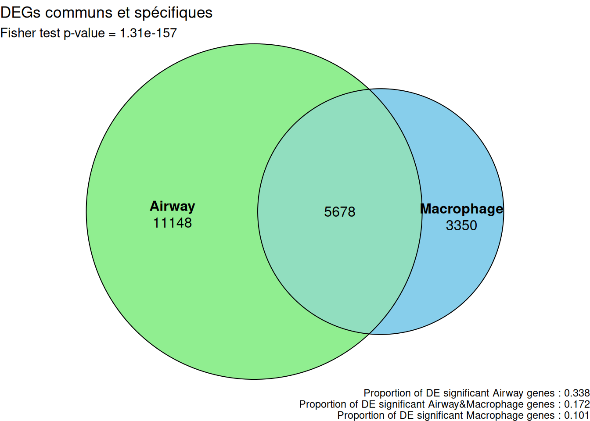
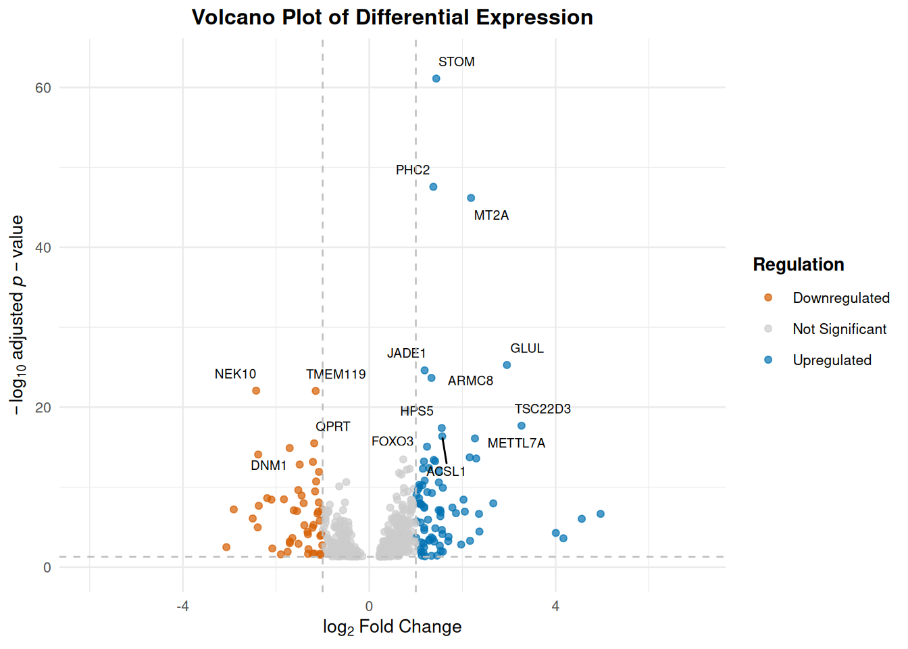
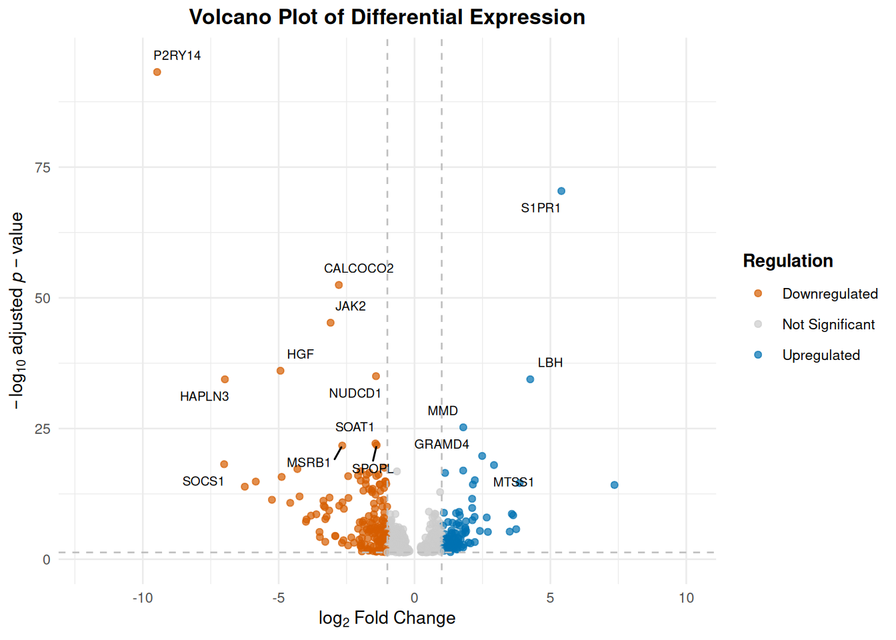
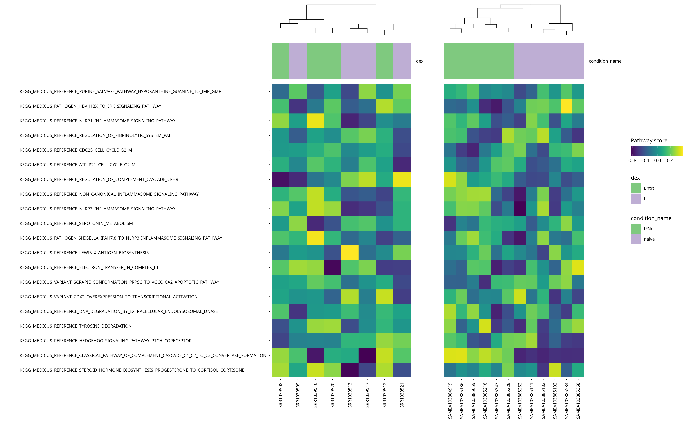

# Comparing two datasets with Venn Diagram


Here is an example of an application for the function `plot_venn`. For
this script, we used 2 different public datasets `airway` and
`macrophage`.

If you want to use this notebook for your projects, it is available
[here](https://github.com/crcordeliers/CAIBIrnaseq/blob/dev/vignettes/venn.qmd)

The `airway` dataset provides a gene expression dataset derived from
**human bronchial epithelial cells**, treated or not with
**dexamethasone** (a corticosteroid).

The `macrophage` dataset provides bulk RNA-seq count data from **human
monocyte-derived macrophages**. These cells were either left untreated
or stimulated with interferon-gamma (IFN-γ).  
An experimental condition was applied to each of these cells, left
**unstimulated**, stimulated with **IFN-gamma**, infected with
**SL1344**, or pre-treated with **IFN-g** and then infected with
**SL1344**. For this comparison, we will focus on the samples of the 2
first conditions (IFN-g, naive).

To compare the datasets, we will do the pre-processing part of the sup
and unsup analysis, until the diffexp.

``` r
annotation_air <- "dex"
annotation_mac <- "condition_name"

diffexpMethod <- "limma"
```

## Import libraries

``` r
library(airway)
library(SummarizedExperiment)
library(macrophage)
library(biomaRt)
library(ggplot2)
library(CAIBIrnaseq)
```

## Load datasets

``` r
#Loading the 2 datasets
data(airway, package="airway"); 
airway <- airway

data("gse")
macrophage <- gse; rm(gse)
macrophage <- macrophage[,macrophage$condition %in% c("naive", "IFNg")] # focus on these 2 conditions
```

Even if the datasets are globally build the same way, the names of the
variables are not exactly the same, so if we want to keep the same code,
we need to redefine a bit the variables.

If you want to know what are the used variables in this part, run this
command line : `colnames(SummarizedExperiment::rowData(exp_data))`

You should have these variables (with these exact same names):  
- **gene_name** : The commonly used symbol or name for the gene (e.g.,
A1BG).  
- **gene_id** : A unique and stable identifier for the gene, often from
databases like Ensembl (e.g., ENSG00000141510).  
- **gene_length_kb** : The length of the gene measured in kilobases  
- **gene_description** : A brief textual summary of the gene’s function
or characteristics, often pulled from annotation databases.  
- **gene_biotype** : A classification of the gene based on its
biological function or transcript type, such as protein_coding, lncRNA,
or pseudogene.

If not, you should look at how your dataset is defined. You might need
to run some command line as the following ones:

``` r
rowData(airway)$gene_length_kb <-(rowData(airway)$gene_seq_end - rowData(airway)$gene_seq_start) / 1000

mart_air <- useEnsembl("ensembl", dataset = "hsapiens_gene_ensembl")

gene_ids_air <- rowData(airway)$gene_id

annot_air <- getBM(attributes = c("ensembl_gene_id", "description"),
               filters = "ensembl_gene_id",
               values = gene_ids_air,
               mart = mart_air)

matched_air <- match(rowData(airway)$gene_id, annot_air$ensembl_gene_id)
rowData(airway)$gene_description <- annot_air$description[matched_air]
```

``` r
rowData(macrophage)$gene_length_kb <- width(rowRanges(macrophage)) / 1000
rownames(macrophage) <- sub("\\..*$", "", rowData(macrophage)$gene_id)
rowData(macrophage)$gene_id <- sub("\\..*$", "", rowData(macrophage)$gene_id)

rowData(macrophage)$gene_name <- rowData(macrophage)$SYMBOL

macrophage <- macrophage[!is.na(rowData(macrophage)$SYMBOL), ]

mart_mac <- useEnsembl("ensembl", dataset = "hsapiens_gene_ensembl")

annot_mac <- getBM(
  attributes = c("ensembl_gene_id", "gene_biotype", "description"),
  filters = "ensembl_gene_id",
  values = unique(rowData(macrophage)$gene_id),
  mart = mart_mac
)
# Correspondance entre gene_id et annot_mac
match_mac <- match(rowData(macrophage)$gene_id, annot_mac$ensembl_gene_id)

# Ajouter les colonnes dans rowData
rowData(macrophage)$gene_biotype <- annot_mac$gene_biotype[match_mac]
rowData(macrophage)$gene_description <- annot_mac$description[match_mac]
```

## Pre-processing

Most datasets use ensembl gene ID by default after alignment, so this
step rebases the expression data to gene names. This ensures consistency
in naming for downstream analyses.

``` r
airway <- rebase_gexp(airway, keep_cols = c("gene_name", "gene_id", 
                                                "gene_biotype", "gene_length_kb"))
```

``` r
macrophage <- rebase_gexp(macrophage, keep_cols = c("gene_name", "gene_id", 
                                                "gene_biotype", "gene_length_kb"))
```

## Filter

Here, we filter out genes expressed in too few samples or with very low
counts. This removes noise from the data and focuses on meaningful gene
expressions.

``` r
airway <- filter_gexp(airway,
                        min_nsamp = 1, 
                        min_counts = 1)
```

``` r
macrophage <- filter_gexp(macrophage,
                        min_nsamp = 1, 
                        min_counts = 1)
```

### Quality Control

Visualization of the filtering process to ensure the criteria applied
align with the dataset’s characteristics:

``` r
colData(airway)$sample_id <- colnames(airway)
plot_qc_filters(airway)
```

``` r
colData(macrophage)$sample_id <- colnames(macrophage)
plot_qc_filters(macrophage)
```

## Normalize

Here, we apply a normalization to the expression data, making samples
comparable by reducing variability due to technical differences. For
datasets with few samples, `rlog` is the preferred normalization and
when more samples are present, `vst` is applied.

``` r
airway <- normalize_gexp(airway)
assay(macrophage) <- round(assay(macrophage))
macrophage <- normalize_gexp(macrophage)
```

## PCA

Principal component analysis (PCA) identifies the major patterns in the
dataset. These patterns help explore similarities or differences among
samples based on gene expression.

``` r
#|message: false
metadata(airway)[["pca_res"]] <- pca_gexp(airway)
annotations <- setdiff(annotation_air, c("exp_cluster", "path_cluster"))
plot_pca(airway, color = annotation_air)
```

``` r
metadata(macrophage)[["pca_res"]] <- pca_gexp(macrophage)
annotations <- setdiff(annotation_mac, c("exp_cluster", "path_cluster"))
plot_pca(macrophage, color = annotation_mac)
```

## Diffexp

**Differential expression analysis** is a key step in RNA-seq data
interpretation. It aims to identify genes whose expression levels
significantly change between experimental conditions—in this case,
between treated and untreated airway samples, and between
IFNg-stimulated and naive macrophages. By statistically testing gene
expression differences, this analysis highlights **biologically relevant
genes** that may be involved in **specific cellular responses or disease
mechanisms**. .

``` r
library(edgeR)
colData(airway)$dex <- factor(colData(airway)$dex)

colData(airway)$dex <- factor(colData(airway)$dex, levels = c("untrt", "trt"))
diffexp_air <- diffExpAnalysis(airway, design = annotation_air, contrasts = "dex_trt_vs_untrt")

colData(macrophage)$condition_name <- factor(colData(macrophage)$condition_name)
colData(macrophage)$condition_name <- factor(colData(macrophage)$condition_name, levels = c("IFNg", "naive"))

diffexp_mac <- diffExpAnalysis(macrophage, design = annotation_mac, contrasts = "condition_name_naive_vs_IFNg")
```

## Venn Diagram

Once the diffexp done, we can plot the venn diagram. Since the datasets
are not directly related, it could be interesting to see if there are
still similarities. The comparison can be made between genes, pathways,
…

If there are similarities, it can means that some biological processes
are activated for different condition types.

This diagram show us how much genes are unique to one dataset, and which
are in common. The fisher test value corresponds to the reliability of
this analysis. The nearer it is to 0, the most significant this analysis
is.

``` r
#|message: false
# Exemple : extraction des degs_airgènes DE significatifs
degs_air <- rownames(diffexp_air[diffexp_air$padj < 0.05, ])    # you can change the threshold 'padj'
degs_mac <- rownames(diffexp_mac[diffexp_mac$padj < 0.05, ])
# universe_size <- length(union(degs_air, degs_mac))
universe_size <- length(unique(rownames(diffexp_air)))

# Diagramme de Venn
plot_venn(degs_air, degs_mac, universe_size,
          v1_name = "Airway", v2_name = "Macrophage",
          fills = c("lightgreen", "skyblue"),
          title = "DEGs communs et spécifiques")
```



``` r
trt <- airway[,colData(airway)$dex == "trt"]
```

## Additional analyses

### Collections

The `airway` and `macrophage` datasets have some common genes. We can
visualize it with the venn diagram. Now that we know that, maybe we can
further analyse whether it is ‘random’ or something about a biological
process.

``` r
inter <- intersect(degs_air, degs_mac)

msigdbr::msigdbr_collections() |>
  kableExtra::kbl() |>
  kableExtra::kable_styling() |>
  kableExtra::scroll_box(height = "300px")
```

| db_version | gs_collection | gs_subcollection | gs_collection_name                   | num_genesets |
|:-----------|:--------------|:-----------------|:-------------------------------------|-------------:|
| 2026.1.Hs  | C1            |                  | Positional                           |          302 |
| 2026.1.Hs  | C2            | CGP              | Chemical and Genetic Perturbations   |         3555 |
| 2026.1.Hs  | C2            | CP               | Canonical Pathways                   |           19 |
| 2026.1.Hs  | C2            | CP:BIOCARTA      | BioCarta Pathways                    |          292 |
| 2026.1.Hs  | C2            | CP:KEGG_LEGACY   | KEGG Legacy Pathways                 |          186 |
| 2026.1.Hs  | C2            | CP:KEGG_MEDICUS  | KEGG Medicus Pathways                |          658 |
| 2026.1.Hs  | C2            | CP:PID           | PID Pathways                         |          196 |
| 2026.1.Hs  | C2            | CP:REACTOME      | Reactome Pathways                    |         1839 |
| 2026.1.Hs  | C2            | CP:WIKIPATHWAYS  | WikiPathways                         |          925 |
| 2026.1.Hs  | C3            | MIR:MIRDB        | miRDB                                |         2377 |
| 2026.1.Hs  | C3            | MIR:MIR_LEGACY   | MIR_Legacy                           |          221 |
| 2026.1.Hs  | C3            | TFT:GTRD         | GTRD                                 |          506 |
| 2026.1.Hs  | C3            | TFT:TFT_LEGACY   | TFT_Legacy                           |          610 |
| 2026.1.Hs  | C4            | 3CA              | Curated Cancer Cell Atlas gene sets  |          148 |
| 2026.1.Hs  | C4            | CGN              | Cancer Gene Neighborhoods            |          427 |
| 2026.1.Hs  | C4            | CM               | Cancer Modules                       |          431 |
| 2026.1.Hs  | C5            | GO:BP            | GO Biological Process                |         7538 |
| 2026.1.Hs  | C5            | GO:CC            | GO Cellular Component                |         1080 |
| 2026.1.Hs  | C5            | GO:MF            | GO Molecular Function                |         1872 |
| 2026.1.Hs  | C5            | HPO              | Human Phenotype Ontology             |         5793 |
| 2026.1.Hs  | C6            |                  | Oncogenic Signature                  |          189 |
| 2026.1.Hs  | C7            | IMMUNESIGDB      | ImmuneSigDB                          |         4872 |
| 2026.1.Hs  | C7            | VAX              | HIPC Vaccine Response                |          347 |
| 2026.1.Hs  | C8            |                  | Cell Type Signature                  |          866 |
| 2026.1.Hs  | C9            |                  | Computational Perturbation Signature |           62 |
| 2026.1.Hs  | H             |                  | Hallmark                             |           50 |

### Volcano

The 2 volcano plots show us top 15 differential expressed genes.

``` r
#|message: false
diffexp_air$gene <- rownames(diffexp_air)
diffexp_mac$gene <- rownames(diffexp_mac)

# Gènes significatifs (par exemple padj < 0.05)
sig_air <- diffexp_air[diffexp_air$padj < 0.05, ]
sig_mac <- diffexp_mac[diffexp_mac$padj < 0.05, ]

# Gènes en commun (par nom de gène)
common_genes <- intersect(sig_air$gene, sig_mac$gene)

# Sous-ensemble des jeux avec uniquement les gènes communs
common_air <- diffexp_air[diffexp_air$gene %in% common_genes, ]
common_mac <- diffexp_mac[diffexp_mac$gene %in% common_genes, ]

plot_exp_volcano(common_air, 15)
```



``` r
plot_exp_volcano(common_mac, 15)
```



### Heatmaps

``` r
dir.create("results", "airway", "pathways")
dir.create("results", "macrophage", "pathways")


pathway_collections <- c("CP:KEGG_MEDICUS")

pathways <- get_annotation_collection(pathway_collections, 
                                      species = "human")
scores_airway <- score_pathways(airway, pathways, verbose = FALSE)
scores_macrophage <- score_pathways(macrophage, pathways, verbose = FALSE)

# Identifier les pathways communs
common_paths <- intersect(rownames(scores_airway), rownames(scores_macrophage))## Warning in prep_scores_hm(exp_data, progeny_scores): 'sample_id' already exists

# Définir un ordre commun basé sur les scores moyens dans airway
order_common <- rowMeans(scores_airway[common_paths, , drop = FALSE]) |>
  sort(decreasing = TRUE) |>
  names()

# Re-générer les heatmaps dans le même ordre
collections <- pathway_collections |> 
  paste(collapse = "_") |> 
  stringr::str_remove("\\:")

# Réordonner les matrices selon cet ordre
scores_airway <- scores_airway[order_common, ]
scores_macrophage <- scores_macrophage[order_common, ]

# Remplacer les anciennes matrices dans les objets
metadata(airway)[["pathway_scores"]] <- scores_airway
metadata(macrophage)[["pathway_scores"]] <- scores_macrophage

dir.create("results", "airway", "pathways")
dir.create("results", "macrophage", "pathways")


# airway
plt_air <- plot_pathway_heatmap(airway, annotations = annotation_air,
                     fwidth = 9,
                     cluster_rows = FALSE,
                     fname = stringr::str_glue("results/airway/pathways/hm_paths_{collections}_top20_aligned.pdf"))
```

    Called from: prep_scores_hm(exp_data, pathway_scores, pathways)
    debug: samp_annot <- as.data.frame(colData(exp_data))
    debug: if ("sample_id" %in% colnames(samp_annot)) {
        warning("'sample_id' already exists in colData and will be overwritten.")
        samp_annot <- samp_annot[, colnames(samp_annot) != "sample_id"]
    }
    debug: warning("'sample_id' already exists in colData and will be overwritten.")

    debug: samp_annot <- samp_annot[, colnames(samp_annot) != "sample_id"]
    debug: samp_annot <- rownames_to_column(samp_annot, "sample_id")
    debug: path_table <- as.data.frame(t(pathway_scores[feats, , drop = FALSE]))
    debug: if ("sample_id" %in% colnames(path_table)) {
        warning("'sample_id' already exists in `pathway_scores` and will be overwritten.")
        path_table <- path_table[, colnames(path_table) != "sample_id"]
    }
    debug: path_table <- rownames_to_column(path_table, "sample_id")
    debug: path_table <- dplyr::left_join(path_table, samp_annot, by = "sample_id")
    debug: hm_data <- list(table = path_table, colv = "sample_id", rowv = feats)
    debug: return(hm_data)

``` r
# macrophage
plt_mac <- plot_pathway_heatmap(macrophage, annotations = annotation_mac,
                     fwidth = 9,
                     cluster_rows = FALSE,
                     show_rownames = FALSE,
                     fname = stringr::str_glue("results/macrophage/pathways/hm_paths_{collections}_top20_aligned.pdf"))
```

    Called from: prep_scores_hm(exp_data, pathway_scores, pathways)
    debug: samp_annot <- as.data.frame(colData(exp_data))
    debug: if ("sample_id" %in% colnames(samp_annot)) {
        warning("'sample_id' already exists in colData and will be overwritten.")
        samp_annot <- samp_annot[, colnames(samp_annot) != "sample_id"]
    }
    debug: warning("'sample_id' already exists in colData and will be overwritten.")

    debug: samp_annot <- samp_annot[, colnames(samp_annot) != "sample_id"]
    debug: samp_annot <- rownames_to_column(samp_annot, "sample_id")
    debug: path_table <- as.data.frame(t(pathway_scores[feats, , drop = FALSE]))
    debug: if ("sample_id" %in% colnames(path_table)) {
        warning("'sample_id' already exists in `pathway_scores` and will be overwritten.")
        path_table <- path_table[, colnames(path_table) != "sample_id"]
    }
    debug: path_table <- rownames_to_column(path_table, "sample_id")
    debug: path_table <- dplyr::left_join(path_table, samp_annot, by = "sample_id")
    debug: hm_data <- list(table = path_table, colv = "sample_id", rowv = feats)
    debug: return(hm_data)

``` r
require(patchwork)
require(ggheatmapper)
ggsave("results/heatmap_big.png", align_heatmaps(plt_air, plt_mac), width = 16, height = 10, dpi = 300)
```

Click to zoom in :

[](https://crcordeliers.github.io/CAIBIrnaseq/articles/results/heatmap_big.png)

See the plot
