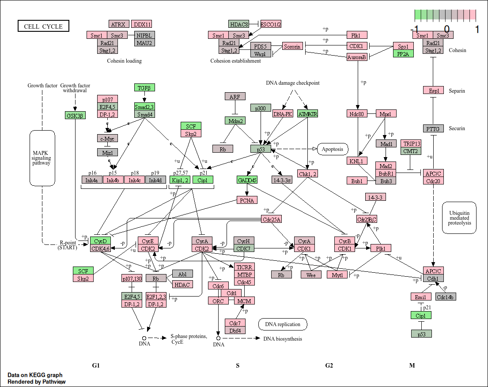

An additional analysis is given by the [Pathview package](https://bioconductor.org/packages/release/bioc/html/pathview.html)

**Pathview** is an R tool used to visualize gene expression data on biological pathways (from KEGG), it helps for seeing how the genes of interest are involved in known cellular processes like the cell cycle or apoptosis.

To create the cell cycle graph, we use the function `pathview`. The expected input for this function is a vector of the **log2FoldChange** of the DE genes. 

If you want to use this notebook for your projects, it is available [here](https://github.com/crcordeliers/CAIBIrnaseq/blob/dev/vignettes/pathview.Rmd)


## Pre-processing

In this page, you will only see the specific code to get the graph. The first steps are the same for every visualization. Before the next cells of code, you will need to do all the pre-processing analyses, until the **diffexp**. If you want to see the code, you can copy/paste it from the [other pages](https://crcordeliers.github.io/CAIBIrnaseq/articles/venn.html)

```{r, include=FALSE, message=FALSE, warning=FALSE}
#|message: false

annotation_mac <- "condition_name"
diffexpMethod <- "DESeq2"

library(pathview)
library(airway)
library(SummarizedExperiment)
library(macrophage)
library(biomaRt)
library(CAIBIrnaseq)
library(knitr)

data("gse")
macrophage <- gse; rm(gse)
macrophage <- macrophage[,macrophage$condition %in% c("naive", "IFNg")]
rowData(macrophage)$gene_length_kb <- width(rowRanges(macrophage)) / 1000
rownames(macrophage) <- sub("\\..*$", "", rowData(macrophage)$gene_id)
rowData(macrophage)$gene_id <- sub("\\..*$", "", rowData(macrophage)$gene_id)

rowData(macrophage)$gene_name <- rowData(macrophage)$SYMBOL

macrophage <- macrophage[!is.na(rowData(macrophage)$SYMBOL), ]

mart_mac <- useEnsembl("ensembl", dataset = "hsapiens_gene_ensembl")

annot_mac <- getBM(
  attributes = c("ensembl_gene_id", "gene_biotype", "description"),
  filters = "ensembl_gene_id",
  values = unique(rowData(macrophage)$gene_id),
  mart = mart_mac
)
# Correspondance entre gene_id et annot_mac
match_mac <- match(rowData(macrophage)$gene_id, annot_mac$ensembl_gene_id)

# Ajouter les colonnes dans rowData
rowData(macrophage)$gene_biotype <- annot_mac$gene_biotype[match_mac]
rowData(macrophage)$gene_description <- annot_mac$description[match_mac]

macrophage <- rebase_gexp(macrophage, annotation = "SYMBOL")

macrophage <- filter_gexp(macrophage,
                        min_nsamp = 1, 
                        min_counts = 1)

colData(macrophage)$sample_id <- colnames(macrophage)

assay(macrophage) <- round(assay(macrophage))
macrophage <- normalize_gexp(macrophage)

metadata(macrophage)[["pca_res"]] <- pca_gexp(macrophage)
annotations <- setdiff(annotation_mac, c("exp_cluster", "path_cluster"))


colData(macrophage)$condition_name <- factor(colData(macrophage)$condition_name)
colData(macrophage)$condition_name <- factor(colData(macrophage)$condition_name, levels = c("IFNg", "naive"))


diffexp_mac <- diffExpAnalysis(countData = assays(macrophage)$counts,
                                          sampleInfo = colData(macrophage),
                                          method = diffexpMethod, cutoff = 10,
                                          annotation = annotation_mac)

```
This is what you get after the `diffexp`:
```{r}
head(diffexp_mac)
```
## Conversion

The next cell will take the log2FoldChange and ENTREZID to get the expected object for the `pathview` function. 

```{r, message=FALSE, warning=FALSE}
#|message: false
library(org.Hs.eg.db)
library(dplyr)

# Retrieve the gene symbols from the row names of the differential expression data
gene_symbols <- rownames(diffexp_mac)

# Convert gene symbols to Entrez IDs using the org.Hs.eg.db annotation database
conversion <- AnnotationDbi::select(
  org.Hs.eg.db,                   # Human gene annotation package
  keys = gene_symbols,            # List of gene symbols to convert
  columns = c("ENTREZID"),        # We want to retrieve Entrez IDs
  keytype = "SYMBOL"              # Input key type is gene symbol
)

# Add gene symbols as a new column in the expression data
diffexp_mac$SYMBOL <- rownames(diffexp_mac)

# Merge the differential expression data with the Entrez ID conversion table
diffexp_mac <- dplyr::left_join(diffexp_mac, conversion, by = "SYMBOL")

# Create a named vector of log2 fold changes using Entrez IDs as names
gene.data <- diffexp_mac$log2FoldChange
names(gene.data) <- diffexp_mac$ENTREZID

# Remove entries with missing Entrez ID names
gene.data <- gene.data[!is.na(names(gene.data))]

# Display the first few elements of the vector
head(gene.data)

```

## Graph

Once done, we can call the function with specific parameters that match our dataset. 

```{r, message=FALSE, warning=FALSE}
#|message: false
pathview(
  gene.data = gene.data,              # Named vector of log2FoldChange values for DE genes 
  pathway.id = "hsa04110",            # KEGG pathway ID
  species = "hsa",                    # Species code for Homo sapiens
  gene.idtype = "entrez",             # The type of gene IDs used in gene.data
  out.suffix = "macrophage_apoptosis", # Name for the output files 
  low = "lightgreen",                 # Color for low log2 fold change values
  high = "pink",                      # Color for high log2 fold change values
  na.color = "gray",                  # Color for genes not mapped or without data
  kegg.native = TRUE                  
)
```

```{r, echo=FALSE, out.width='120%', fig.align='center'}


```
Using the `pathview package`, we visualized the impact of `differentially expressed genes` from the macrophage dataset on the KEGG apoptosis pathway (**hsa04110**). The pathway diagram highlights genes based on their **log2FoldChange** values: **upregulated** genes are shown in pink (Cdc25a, CycA, CycB, ...), while **downregulated** genes appear in light green (GADD45, Cip1, CycD, ...). Genes with no expression data or missing values are colored gray. This visualization allows us to assess how the **IFN-γ treatment** influences components of the apoptotic signaling cascade, helping to identify specific regulatory points potentially activated or suppressed in *response* to the stimulus.

